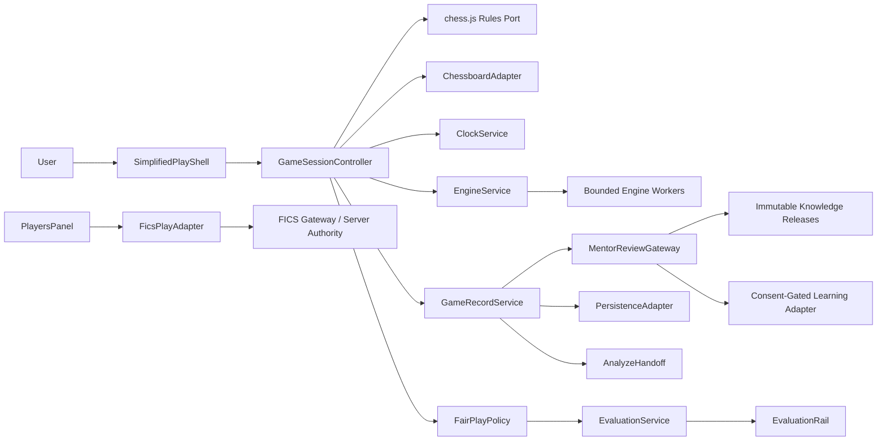
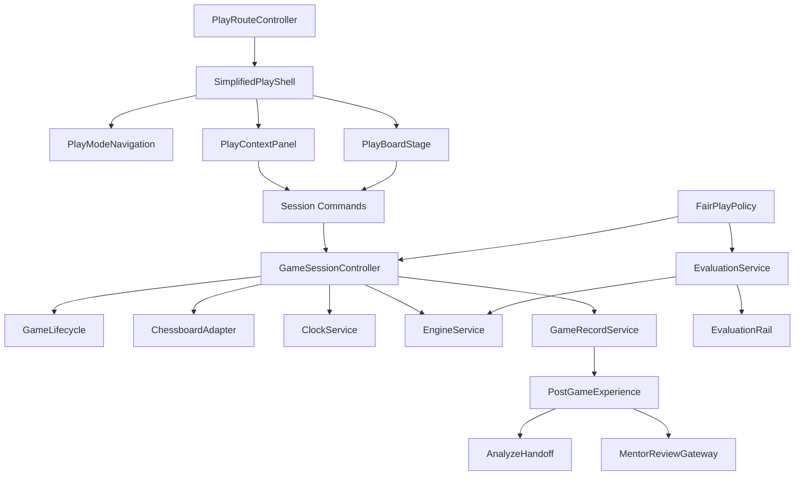
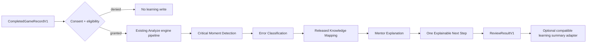

# CAISSA Simplified Play Architecture

Status: authoritative Season 10.0.2 architecture blueprint

Baseline: `32a14876178c6e147f6caae9f3033d7a40191462`

Scope: architecture and migration guidance; no runtime implementation

## 1. Executive Summary

CAISSA Simplified Play will be a board-first workspace with one live game session, one contextual mode panel, a persistent evaluation-rail position, and one primary action per mode. It will evolve by wrapping and then replacing ownership inside the existing `app.js` runtime, not by a framework migration or big-bang rewrite.

The target architecture separates:

- presentation from game truth;
- board input from rules and session state;
- opponent search from evaluation;
- live Play state from Analyze state;
- Coach intervention from Mentor review;
- local games from FICS authority;
- game records from learning evidence;
- policy decisions from UI visibility.

The existing [Play audit](./PLAY_CURRENT_STATE_AUDIT.md), [Board Interaction API v1](./CAISSA_BOARD_INTERACTION_API_V1.md), [Workspace Guidelines](./CAISSA_WORKSPACE_GUIDELINES.md), [Coaching v1](./ENDGAME_COACHING_V1.md), [Training Memory v1](./ENDGAME_TRAINING_MEMORY_V1.md), Knowledge release architecture, canonical navigation inventory, Analyze implementation, and FICS/Classic contracts remain authoritative within their scopes.

The first implementation work must be characterization tests and compatibility boundaries. Visual migration cannot begin until duplicate initialization, move correctness, engine request ownership, game-record normalization, and fair-play behavior have enforceable tests.

## 2. Product Principles

1. **Simplicity on the outside; intelligence underneath.**
2. **Board first.** Auxiliary state never remounts or obscures the board.
3. **One owner per fact.** DOM, labels, and panels render state; they do not become state.
4. **One primary action per mode.** Advanced actions use progressive disclosure.
5. **One live session.** Every local Play mode uses the same lifecycle and record contract.
6. **Policy before presentation.** FairPlayPolicy decides assistance; UI only renders its decision.
7. **Immutable integration.** Analyze and Mentor receive snapshots, never mutable Play objects.
8. **External authority stays external.** FICS owns FICS clocks, moves, identity, connection and results.
9. **Educational roles stay distinct.** Bot opposes, Coach teaches during a session, Mentor guides across sessions.
10. **Compatibility is temporary and measurable.** Every adapter has removal criteria.
11. **No framework prerequisite.** ES modules and existing browser infrastructure are sufficient.
12. **Accessibility, disposal, recovery and observability are architectural requirements.**

## 3. Audit-Derived Constraints

The audit found a 7,501-line global `app.js`, shared mutable `App.game`/`App.board`, engine callback replacement, fragmented clocks/results/persistence, independent FICS/Arena/Spectator/training lifecycles, possible duplicate listeners, worker retention, incomplete PGN records, no fair-play gate, and a brittle mobile CSS cascade.

Therefore:

- new modules may read legacy state only through versioned adapters;
- exactly one command path may mutate the active local game;
- `ChessboardAdapter` must implement Board Interaction API v1;
- opponent and evaluation requests require purpose-scoped ownership;
- Play and Analyze must never share a mutable chess.js instance;
- route state must be URL-backed and history-aware;
- FICS cannot be treated as a local `GameLifecycle` implementation until an adapter is proven;
- visual replacement waits for characterization and resource-lifecycle gates;
- existing IDs/query parameters remain supported during migration;
- current behavior is not claimed functional merely because markup exists.

## 4. Scope and Non-Goals

In scope:

- target boundaries, contracts, schemas and dependency direction;
- Games, Bots, Coach, Players presentation model;
- local unified lifecycle;
- engine/evaluation/fair-play architecture;
- records, recovery, Analyze and Mentor handoffs;
- responsive/accessibility/resource contracts;
- incremental migration, tests, rollback and removal gates.

Non-goals:

- production UI or route changes;
- implementation file layout;
- chess.js/chessboard.js upgrade;
- a framework rewrite;
- a new analyzer;
- a CAISSA multiplayer backend;
- FICS protocol or gateway changes;
- calibrated Elo, matchmaking, friends or tournaments;
- cloud sync, authoritative anti-cheat or account policy;
- changing Training Memory, Knowledge, Mastery or Recommendation semantics.

## 5. Product Definitions

### 5.1 Games

Games is the session-start and recent-game surface. Initially it represents capabilities that exist: quick local machine setup and completed/recoverable local records. It may link to FICS human play through Players. Local human play, friend challenge, matchmaking, tournaments and a future CAISSA network remain unavailable until independently implemented and must not be presented as working.

### 5.2 Bots

A Bot is an opponent described by a versioned `BotProfile`. The profile selects an engine preset and controlled behavior; it does not own a worker. Displayed rating is “estimated CAISSA difficulty” unless calibrated.

### 5.3 Coach

A Coach is a pedagogical session configuration with deterministic intervention policy. A Coach may use a Bot as the opposing move source, but owns teaching focus, hint progression and feedback—not opponent search, board state, Mastery, or long-term recommendations.

### 5.4 Mentor

Mentor is a cross-cutting educational service. It may set a pre-game objective and review completed games through Analyze-derived evidence, released Knowledge Units, consented learning storage and recommendation boundaries. Mentor never makes live opponent moves and is not a dependency of board input or the active lifecycle.

### 5.5 Players

Players is discovery and entry for human/external play. Initially it exposes FICS as an explicitly external system. Future CAISSA matchmaking, friends and presence require a separate network architecture and server-authoritative fair-play model.

## 6. Architectural Decisions

| Decision | Recommendation | Rationale | Consequences | Deferred Work |
|---|---|---|---|---|
| Default landing | Keep CAISSA Classic as current desktop/mobile cold-load default during Season 10; make `/play` ready to become a future product default without code branching by device | Avoids an unrelated product switch during migration | Shell cannot assume it is landing page | Owner decision on future switch |
| Games meaning | Existing local machine setup + game records; link, do not impersonate, human services | Repository has no CAISSA multiplayer | Honest capability labels | Local human, friends, matchmaking |
| FICS | External-authority subsystem behind `FicsPlayAdapter`; reachable from Players; share presentation/record contracts first | Server clocks/protocol/results differ | No local engine/eval during active FICS games | Lifecycle convergence after proof |
| Arena | Outside Simplified Play; share EngineService only | Engine-v-engine is a distinct experimental product | No Arena tab in four modes | Product decision on continued visibility |
| Bot model | Registry metadata maps to engine presets; UI and storage keep IDs only | Prevents behavior in UI files | Versioned validation required | Formal calibration/unlocks |
| Coach model | Separate `CoachProfile` and `CoachSessionConfig`; may reference BotProfile | Teaching is not opponent identity | Intervention is policy-gated | Generated coaching expansion |
| Mentor model | Post-game/pre-game gateway outside live board dependencies | Preserves persistent educational role | Async, consented, immutable inputs | Cloud history/personalization |
| Persistence | Validated local v1 adapter for guests; account adapter later; recovery snapshot distinct from completed record | Current reload loses games | Schema/migration/privacy work required | Cloud sync |
| Routes | Canonical `/play[/mode]`; retain `?section=play`, `?fen`, actions via adapters for at least two stable releases | Enables history/cold loads without breaking links | Dual parsing during migration | Remove deprecated queries later |
| Controls | Bind old controls to new commands; remove only after parity telemetry/tests | Prevents hidden-ID regressions | Temporary bridge complexity | Legacy DOM removal |
| Fair play | Central, deny-by-default `FairPlayPolicy` | UI visibility is not enforcement | Every assistance request needs decision evidence | Server anti-cheat |
| Analyze | Immutable versioned handoff via sessionStorage token plus in-memory fast path | Survives same-tab refresh without large URLs | TTL and validation required | Durable cross-device analysis |
| Engine topology | Purpose-isolated logical channels over a bounded pool: two workers desktop, normally one mobile; serialize when constrained | Avoids callback collision and mobile pressure | Scheduler/cancellation required | Adaptive pool tuning |
| Framework | Retain browser modules; no framework migration prerequisite | Audit does not prove a framework need | Architecture enforced by contracts/tests | Optional later UI technology decision |

## 7. Target System Context



Local Play owns local sessions. FICS remains an external system. Analyze and Mentor are downstream consumers of records, never upstream owners of Play.

## 8. Target Component Architecture

```text
SimplifiedPlayShell
├── PlayRouteController
├── PlayModeNavigation
├── PlayBoardStage
│   ├── PlayerHeader
│   ├── EvaluationRail
│   ├── ChessboardAdapter
│   ├── ClockDisplay
│   └── BoardActions
├── PlayContextPanel
│   ├── GamesPanel
│   ├── BotsPanel
│   ├── CoachPanel
│   └── PlayersPanel
├── GameSessionController
│   ├── GameLifecycle
│   ├── ClockService
│   ├── GameRecordService
│   └── PersistenceAdapter
├── EngineService
├── EvaluationService
├── FairPlayPolicy
├── BotRegistry
├── CoachRegistry
├── PostGameExperience
├── AnalyzeHandoff
├── MentorReviewGateway
└── Compatibility Boundary
    ├── LegacyPlayReadAdapter
    ├── LegacyPlayCommandAdapter
    └── LegacyControlBridge
```

Target dependencies:



No presentation module imports a worker, mutates chess.js, writes storage directly, or calculates policy.

## 9. Module Ownership Matrix

| Module | Owns | Does Not Own | Dependencies | Public Contract | Cleanup Responsibility |
|---|---|---|---|---|---|
| PlayRouteController | canonical mode route/history | game/session state | canonical nav inventory, shell | `resolve`, `navigate`, route events | remove history listener |
| SimplifiedPlayShell | composition, focus return, responsive regions | chess truth, policy | route + read models | `mount`, `render`, `dispose` | observers/shell listeners |
| PlayModeNavigation | active UI mode selection | active game mode mutation | route controller | semantic tab/navigation commands | roving focus listeners |
| ChessboardAdapter | board mount/view/orientation/selection | rules, lifecycle, engine | Board API v1, board library | immutable move intents, render snapshot | Board API `dispose`, DOM listeners |
| GameSessionController | orchestration and command authorization | presentation, worker internals | lifecycle, rules, clock, records, policy | `dispatch(command)`, session events | cancel work, dispose dependencies |
| GameLifecycle | state and legal transitions | DOM/effects | pure schemas | `transition(state,event)` | none |
| ClockService | local monotonic clock or authority adapter | result/UI | lifecycle, clock source | ticks/snapshots/start/stop | RAF/timers/subscriptions |
| EngineService | worker pool, requests, cancellation | policy/UI/game truth | registry/worker factory | request handle + result stream | stop/terminate/release |
| EvaluationService | evaluation job/state normalization | permission, rendering | policy decision, EngineService | EvaluationSnapshot stream | cancel evaluation |
| EvaluationRail | accessible rail rendering/layout slot | engine/policy | evaluation snapshot | render-only state | animation/listener cleanup |
| FairPlayPolicy | assistance decision | UI or worker execution | trusted game context | immutable `PolicyDecision` | none |
| GameRecordService | active snapshot serialization and completed record | storage/account/learning | lifecycle, rules, clock | validate/build/export records | flush/cancel pending write |
| PostGameExperience | completed-game actions | record mutation/analysis | completed record, gateways | rematch/analyze/mentor/export commands | cancel UI-only pending work |
| AnalyzeHandoff | immutable payload validation, TTL/token | analysis execution | session storage, Analyze adapter | create/consume one-time handoff | expire/remove payload |
| BotRegistry | validated BotProfile catalog | workers/UI/localization | engine preset catalog | query/resolve profile | none |
| CoachRegistry | validated CoachProfile catalog/config | Mentor/Mastery/engine | coaching contract, Knowledge refs | resolve session config | none |
| MentorReviewGateway | review request orchestration | live board/session mutation | Analyze, Knowledge, consent adapter | async review request/result | cancel/retry cleanup |
| PersistenceAdapter | versioned local reads/writes/migration | domain decisions | browser storage | atomic load/save/delete | storage subscriptions |
| FicsPlayAdapter | translation of FICS events to presentation/record snapshots | FICS authority/protocol | existing FICS client | external session read model/commands | unsubscribe/unobserve only |
| LegacyPlayReadAdapter | frozen projection from `App` | new writes | current globals | versioned snapshot | detach subscriptions |
| LegacyPlayCommandAdapter | old behavior invocation during migration | direct new state mutation | current functions | narrow command methods | none |
| LegacyControlBridge | bind old IDs once to command bus | domain behavior | shell + commands | idempotent bind/unbind | remove exact listeners |

Each module has unit tests at its public contract; adapters additionally have integration tests against current runtime behavior.

Lifecycle and test boundaries:

- RouteController, Shell, ModeNavigation, ChessboardAdapter, EvaluationRail and LegacyControlBridge are mounted once per shell and disposed on shell replacement; mount/dispose and repeated-entry browser tests are mandatory.
- GameSessionController, GameLifecycle, ClockService, GameRecordService and session-scoped engine/evaluation work live from session creation through `SESSION_DISPOSED`; pure transition tests plus fake-clock/worker integration tests are mandatory.
- EngineService may outlive a session only as a bounded application service; request handles never do. Scheduler, crash, timeout, stale-output and pool-limit unit tests define its boundary.
- FairPlayPolicy, BotRegistry and CoachRegistry are pure/versioned catalogs or functions with no mount lifecycle; schema and decision-table unit tests define their boundary.
- PostGameExperience, AnalyzeHandoff and MentorReviewGateway live only for a completed record/action; cancellation, retry, corruption, expiry and immutable-payload integration tests define their boundary.
- PersistenceAdapter lives at application scope but every subscription is disposable; migration, quota, atomicity, corruption and cross-tab tests define its boundary.
- FicsPlayAdapter lives for one external connection/observation subscription; fixture-driven authority, disconnect, stale Style12 and unsubscription tests define its boundary.
- Legacy read/write adapters live only while their ownership ledger entry remains active; parity tests and zero-use diagnostics are prerequisites to removal.

## 10. Authoritative State Model

All state objects are versioned, validated and immutable at public boundaries.

**UI state** (`PlayUiState`): active panel mode, selected profile IDs, expanded options, loading/error presentation, focus return target and panel scroll restoration. Owned by shell/navigation. It does not contain chess truth.

**Game configuration** (`GameConfiguration`): source, mode, opponent type/ID, player color, time control, variant, assistance declaration, Coach config ID, evaluation preference and Mentor post-game preference. Owned by GameSessionController before start; frozen into a session at `GAME_STARTED`.

**Active game** (`ActiveGameSnapshot`): session ID, lifecycle state, immutable position token, FEN, turn, verbose move list, clocks, participants, result/termination, pending promotion, connection state and timestamps. Owned by GameSessionController/GameLifecycle; rules remain inside the rules port.

**Engine state** (`EngineServiceSnapshot`): worker IDs/states, request ID, session ID, purpose, position token, queue state, start/deadline and cancellation reason. Owned only by EngineService.

**Evaluation state** (`EvaluationSnapshot`): official rail state, White-perspective score/mate, display perspective, depth, timestamp, position token, delay/freeze metadata, policy reason and error. Owned by EvaluationService.

**Persisted state**:

- preferences: last mode/profile, orientation/theme and disclosure;
- recovery record: current local game only, bounded and replaceable;
- completed records: immutable validated game records;
- Analyze handoff: one-time TTL payload;
- Mentor/learning preference: consented and independently versioned.

DOM attributes, selected `<option>` values, CSS classes and `window.App` are never authoritative after their ownership phase. During migration, `LegacyPlayReadAdapter` exposes frozen projections; `LegacyPlayCommandAdapter` is the only allowed write path into legacy behavior. Dual writes are prohibited except for an explicitly tested record-shadow phase where the new side is non-authoritative and discrepancies are diagnostic only.

## 11. Unified Game Lifecycle

States: `idle`, `configuring`, `starting`, `active`, `paused`, `awaiting-promotion`, `ending`, `completed`, `analyzing`, `reviewing`, `rematch-pending`, `error`, `disposed`.

```mermaid
stateDiagram-v2
    [*] --> idle
    idle --> configuring: configure
    configuring --> starting: GAME_REQUESTED
    starting --> active: GAME_STARTED
    starting --> error: ENGINE_FAILED / start failure
    active --> awaiting-promotion: PROMOTION_REQUIRED
    awaiting-promotion --> active: MOVE_COMMITTED
    active --> paused: pause / connection lost
    paused --> active: resume / reconnected
    active --> ending: GAME_END_REQUESTED / terminal rule
    ending --> completed: GAME_COMPLETED
    completed --> analyzing: ANALYSIS_REQUESTED
    completed --> reviewing: MENTOR_REVIEW_REQUESTED
    completed --> rematch-pending: REMATCH_REQUESTED
    analyzing --> completed: analysis handoff complete/cancel
    reviewing --> completed: review complete/cancel
    rematch-pending --> starting: rematch accepted
    completed --> configuring: GAME_RESET
    error --> configuring: recover/reset
    idle --> disposed: SESSION_DISPOSED
    configuring --> disposed: SESSION_DISPOSED
    completed --> disposed: SESSION_DISPOSED
    error --> disposed: SESSION_DISPOSED
```

| State | Allowed transitions | Entry / exit actions | Clock | Engine | Board input | Persistence / public event |
|---|---|---|---|---|---|---|
| idle | configuring, disposed | allocate session shell | stopped | none | disabled | none / session ready |
| configuring | starting, disposed | validate mutable configuration | stopped | optional prewarm only | disabled | preferences only / configuration changed |
| starting | active, error, disposed | create rules, board snapshot, services | initialized, stopped | acquire needed channel | disabled | initial recovery / starting |
| active | paused, awaiting-promotion, ending, error | accept authorized commands | authoritative side runs | purpose jobs allowed by policy | enabled for authorized side | recovery after commits / started, move committed |
| paused | active, ending, error | preserve confirmed board | stopped/frozen | cancel move/eval unless authority says retain | disabled | save connection state / paused |
| awaiting-promotion | active, ending, error | freeze move intent and request choice | continues unless mode policy pauses | no next-position job | promotion choice only | pending state / promotion required |
| ending | completed, error | reject moves, cancel jobs, normalize result | stopped | cancel session jobs | disabled | build record / end requested |
| completed | analyzing, reviewing, rematch-pending, configuring, disposed | freeze final snapshot | stopped | none unless post-game action | navigation only | completed record / completed |
| analyzing | completed, disposed | create Analyze handoff | stopped | owned by Analyze, not Play | disabled | handoff status / analysis requested |
| reviewing | completed, disposed | run/cancel Mentor gateway | stopped | gateway-owned post-game jobs | disabled | consented review status / review requested |
| rematch-pending | starting, completed, disposed | derive new config, never reuse session ID | stopped | none | disabled | none / rematch requested |
| error | configuring, ending, disposed | preserve diagnostics and safe recovery | stopped | cancel failing purpose | disabled | error/recovery snapshot / error |
| disposed | none | idempotent total cleanup | disposed | release all session jobs | disposed | optional final flush / disposed |

Prohibited examples: move outside `active`/promotion completion; live evaluation without policy grant; direct `completed -> active`; session ID reuse on rematch; Analyze mutation of any lifecycle state.

## 12. Event Contract

Event envelope:

```text
PlayEventV1 {
  schemaVersion: "1.0",
  eventId, eventType, occurredAt,
  sessionId?, gameId?, correlationId?,
  source, visibility: "internal" | "integration",
  payload
}
```

| Event | Visibility | Required payload | Consumer |
|---|---|---|---|
| `GAME_CONFIGURATION_CHANGED` | internal | validated partial configuration | shell/controller |
| `GAME_REQUESTED` | internal | frozen configuration | controller |
| `GAME_STARTING` | integration | session ID, mode | diagnostics/UI |
| `GAME_STARTED` | integration | initial snapshot | board/clock/record |
| `MOVE_REQUESTED` | internal | immutable Board API intent | controller |
| `MOVE_COMMITTED` | integration | move, FEN, position token, clocks | board/eval/record |
| `PROMOTION_REQUIRED` | integration | from/to/legal pieces | accessible dialog |
| `CLOCK_UPDATED` | internal by default | monotonic snapshot/source | clock display |
| `GAME_END_REQUESTED` | internal | proposed termination/evidence | lifecycle |
| `GAME_COMPLETED` | integration | completed record reference/snapshot | post-game |
| `ANALYSIS_REQUESTED` | integration | handoff ID and intent | AnalyzeHandoff |
| `MENTOR_REVIEW_REQUESTED` | integration | record ID, consent, objective | Mentor gateway |
| `REMATCH_REQUESTED` | integration | prior game ID, derived config | controller |
| `GAME_RESET` | internal | reason | controller |
| `SESSION_DISPOSED` | integration | session ID, cleanup summary | diagnostics |
| `ENGINE_FAILED` | integration | request/purpose/error category | controller/UI |
| `CONNECTION_LOST` | integration | external source, recoverability | FICS adapter/UI |

Events contain no DOM nodes, live chess.js objects, worker objects, credentials, raw provider secrets or unbounded PGN except the completed record event where explicitly allowed. Commands are validated before events are emitted.

## 13. Game Record Schema

`CompletedGameRecordV1`:

```json
{
  "schemaVersion": "1.0",
  "gameId": "uuid",
  "source": "local",
  "mode": "bots",
  "opponentType": "bot",
  "opponentId": "stockfish-default",
  "playerColor": "white",
  "startedAt": "ISO-8601",
  "endedAt": "ISO-8601",
  "result": "1-0",
  "termination": "checkmate",
  "initialFen": "FEN",
  "finalFen": "FEN",
  "pgn": "PGN",
  "moves": [],
  "timeControl": {"kind":"clock","initialMs":300000,"incrementMs":0},
  "finalClocks": {"whiteMs":0,"blackMs":12000,"authority":"local"},
  "evaluationPolicy": {"policyVersion":"1.0","mode":"live","reason":"bot-game"},
  "coachConfiguration": null,
  "mentorPreference": {"reviewAfterGame":false},
  "analysisStatus": "not-requested",
  "persistenceStatus": "local"
}
```

Mandatory: all listed top-level fields; nullable fields remain present. Moves require ply, SAN, LAN/from/to/promotion, resulting FEN and optional clock. Result is `1-0`, `0-1`, `1/2-1/2`, `*`; termination is a controlled enum including checkmate, resignation, timeout, stalemate, repetition, insufficient-material, fifty-move, agreement, abort, disconnect, engine-failure, external and unknown.

Optional extensions are namespaced and versioned: external IDs, Bot/Coach profile version, source PGN headers, evaluation summaries and consented learning references. Raw engine logs, Mentor chat, credentials and provider identifiers are excluded.

Guests store a bounded local history only after clear notice; an in-progress recovery snapshot is separate and overwritten atomically. Signed-in cloud sync is a future adapter and must preserve the schema, conflict rules and deletion semantics. Unsupported major versions and corrupt records are quarantined/ignored with diagnostics, never partially loaded. Minor migrations are pure, tested and retain original export. Records are bounded by count/size and individually deletable/exportable.

## 14. Engine Service Architecture

Use logical purpose channels (`opponent`, `evaluation`, `post-game-analysis`, `coach`, `mentor`) over a bounded worker pool. Desktop default maximum is two workers; constrained/mobile default is one serialized worker. Analyze may own a separate worker after handoff because the live Play session is no longer active.

Request:

```text
EngineRequestV1 {
  requestId, sessionId, purpose, positionToken, fen,
  limits: { depth?, moveTimeMs?, deadlineMs },
  options, priority, policyDecisionId
}
```

Result messages repeat request/session/purpose/position tokens. A message is accepted only when all tokens match an active request and the deadline/cancellation state permits it. Callback replacement is prohibited; requests receive independent handles/streams.

```mermaid
sequenceDiagram
    participant C as GameSessionController
    participant P as FairPlayPolicy
    participant E as EngineService
    participant W as Worker Channel
    C->>P: decide(context, purpose)
    P-->>C: PolicyDecision
    C->>E: request(requestId, sessionId, purpose, positionToken, decision)
    E->>E: validate, queue, assign worker
    E->>W: position + go
    W-->>E: info/bestmove
    E->>E: match all tokens and deadline
    alt current
        E-->>C: scoped result
    else stale/cancelled
        E-->>E: discard + debug event
    end
    C->>E: cancel(requestId) on move/reset/dispose
    E->>W: stop; release or terminate
```

Startup is lazy on first permitted request. Cancellation sends stop, marks the handle terminal, and ignores late output. Timeouts are purpose-specific. Section exit cancels presentation evaluation; an active local game may retain only the opponent channel if policy/product explicitly permits background continuation—default is pause and release. Game completion cancels opponent/live evaluation. Disposal terminates unshared workers. Worker crash fails only assigned requests, emits `ENGINE_FAILED`, performs at most one bounded restart, and never silently changes a rated/external result. Pool pressure serializes low-priority evaluation and drops superseded jobs. Diagnostics expose worker/request counts without noisy production logs.

## 15. Evaluation System

EvaluationService requests engine work only after a FairPlayPolicy grant. It normalizes engine scores to White perspective and derives player perspective only for presentation. Mate sign follows White perspective. Every snapshot carries the analyzed position token and timestamp.

Official states:

- `live`: current permitted position;
- `delayed`: published after policy delay;
- `frozen`: last permitted value, explicitly timestamped;
- `hidden`: policy says render no rail content;
- `post-game`: completed-game evaluation;
- `unavailable`: mode/capability forbids or lacks evaluation;
- `loading`: permitted request pending, no current value;
- `error`: permitted evaluation failed.

EvaluationRail reserves stable width in the board-stage grid in all states. Hidden/unavailable may render a neutral track or collapse only if the layout contract explicitly preserves board size. Orientation changes alter visual anchoring, not score sign. Animation is short, interruptible and disabled under reduced motion. Stale values never masquerade as live; they become frozen or are cleared per policy. Accessible text includes state, perspective, numeric/mate value, freshness and reason; use meter semantics only for numeric non-mate values.

EvaluationRail is render-only. EvaluationService does not decide permission. FairPlayPolicy does not create engine work.

## 16. Fair-Play Policy

Inputs: source, opponent type, rated/casual, explicit assisted agreement, spectator/training/Coach status, lifecycle status, participant role, consent and requested purpose. Output:

```text
PolicyDecisionV1 {
  decisionId, policyVersion,
  mayRunEngine, mayShowEvaluation, evaluationMode, delayMs,
  mayShowHints, mayUseCoachIntervention, mayAnalyzePostGame,
  reason
}
```

| Context | Run live engine | Show evaluation | Hints / Coach | Post-game analysis | Default rationale |
|---|---:|---|---|---:|---|
| Bot | Yes | live or user-hidden | allowed by config | Yes | Machine opponent |
| Coach opponent | Yes | live/delayed/hidden per teaching config | controlled intervention | Yes | Pedagogical mode |
| Training | Yes when exercise permits | live/delayed/hidden | deterministic policy | Yes | Training contract |
| Human rated | No | hidden | No | Yes after completion | Assistance prohibited |
| Human casual | No | hidden/frozen neutral | No | Yes after completion | Default unassisted |
| Explicit assisted casual | Only with bilateral/server declaration | declared mode only | declared only | Yes | Future, not implemented |
| FICS active | No | hidden | No | Yes only after authoritative completion | Conservative external policy |
| Spectator live | No by default | unavailable; future delayed only | No | After completion | Avoid live assistance |
| Completed game | Yes | post-game | post-game explanation only | Yes | Game no longer active |
| Imported game | Yes | post-game | review guidance | Yes | Static record |

The UI cannot override a denial. A hidden button is not enforcement: EngineService requires a valid decision for assistance purposes. Client policy is defense-in-depth only; future human competition needs server authority and auditing.

## 17. Games Architecture

GamesPanel owns configuration presentation and record selection. Initially its primary action is **Start Game** for a quick machine game. It may show recent validated local records and recovery. It dispatches commands; it never mutates rules, clocks or storage.

Human entry is a clearly labeled link to Players/FICS. Nonexistent matchmaking, friend challenges and tournaments remain absent or explicitly “not available.” Local human play requires a later rules/identity policy decision.

Configuration becomes immutable at start. Switching panels does not switch or destroy an active game. Starting another game requires explicit replacement confirmation and completes/abandons the existing record according to policy.

## 18. Bots Architecture

`BotProfileV1` includes:

```text
schemaVersion, id, version, displayNameKey, descriptionKey, avatarRef,
estimatedRatingLabel, difficultyBand, enginePresetId,
style: { openingPreferences, tacticalBias, positionalBias,
         simplificationTendency, endgameBias, riskPreference },
controlledErrorModel, availability, unlockState
```

Profiles are immutable registry data. `enginePresetId` resolves through engine configuration; it does not expose worker paths to UI. Style values are bounded declarative parameters. Engine-specific translation belongs in an engine-preset adapter. Localization keys and assets are presentation concerns. Persistence stores `{botId, profileVersion?}` and falls back safely when unavailable. Unlock state is entitlement/progress input, not profile mutation.

Controlled errors must be bounded, legal, reproducible under a seed when tested, and never described as human Elo calibration without evidence. Current “full power” behavior maps to a legacy default profile until real presets are implemented.

## 19. Coach Architecture

`CoachProfileV1` owns identity, learner-band applicability, teaching focus, communication-style key, supported intervention levels, hint policy template, feedback policy, post-game policy and released Knowledge references. `CoachSessionConfigV1` freezes selected profile/version, learner level, focus, intervention mode, evaluation policy preference and consent.

Intervention modes:

- **Silent:** no unsolicited speech, hints only on request if policy allows.
- **Light:** concise post-move feedback at configured critical thresholds.
- **Guided:** progressive hints/questions before optional explanation.
- **Teaching:** frequent structured intervention; may pause local play for a question.

Coach speaks only on deterministic triggers owned by the coaching contract: requested hint, classified relevant move, lesson checkpoint or completion. It remains silent during opponent thinking, pending promotion, denied fair-play contexts, stale evaluation, unresolved connection and when no supported evidence exists. Evaluation disclosure is separately granted by FairPlayPolicy. Questions are never required to submit a legal move unless the declared teaching mode says so.

Coach can reference a Bot opponent but is not the Bot. Coach is session-scoped; Mentor is longitudinal and post-game. Coach may emit a consent-eligible educational summary but cannot write Mastery or Recommendations directly.

## 20. Players and FICS Boundary

PlayersPanel discovers human-play providers. In the initial architecture, FICS is the only evidenced provider and is labeled external.

`FicsPlayAdapter` translates existing client events into presentation snapshots and, after authoritative completion, `CompletedGameRecordV1` with `source="fics"` and external metadata. FICS remains authoritative for connection, login, players, legal acceptance, server clocks, move ordering, result and disconnect. Existing Style12 parser, gateway and FICS client are reused; the adapter does not duplicate protocol.

FICS does not initially run inside local GameLifecycle. It may share PlayerHeader, board view ports, record/export display and PostGameExperience after adapter tests. FairPlayPolicy denies active evaluation/hints. Connection loss maps to an external state, not a fabricated local result.

CAISSA Classic continues consuming the existing FICS core under its architecture. Spectator remains separate and read-only. Future convergence requires authoritative event completeness, clock mapping, reconnect semantics, stale Style12 rejection and production integration tests.

Arena remains outside Simplified Play and may consume EngineService after isolation; it does not become Bots mode.

## 21. Mentor Review Architecture

Pipeline:



`MentorReviewRequestV1` contains request ID, completed record or record ID, selected Mentor/profile, pre-game objective, explanation level, maximum critical moments (default 5, hard maximum 10), pinned Knowledge release ID, consent snapshot and locale. It contains no live session object.

`MentorReviewResultV1` contains statuses, analyzed coverage, bounded critical moments with move/evidence/classification, released unit IDs and release pin, explanations, one recommendation signal, limitations and persistence status.

States: queued, analyzing, mapping, explaining, completed, partial, cancelled, error. Cancellation is idempotent. Retry creates a new request ID and may reuse verified analysis evidence. Partial engine/Knowledge failure yields explicit omissions, never invented certainty.

Knowledge mapping reads immutable releases. Training Memory integration requires a separately versioned, consented summary adapter and must respect existing v1 exclusions. Existing trainer “mastery” is not Knowledge mastery. Mentor cannot directly update Mastery or rank Recommendations; it emits explainable signals for their authoritative domains.

## 22. Analyze Handoff

Transport recommendation: a one-time, TTL-bounded `sessionStorage` payload keyed by an opaque random handoff ID, with an in-memory event fast path. The URL contains only `/analyze?handoff=<id>` (final route subject to existing routing integration), never raw PGN. Same-tab refresh can consume the stored payload; expired/missing/corrupt payload falls back to normal Analyze import with a clear message.

`AnalyzeHandoffV1`:

```text
schemaVersion, handoffId, createdAt, expiresAt,
sourceGameId, source, normalizedPgn, initialFen?,
selectedPly?, intent: "full-game" | "position",
returnRoute, checksum
```

```mermaid
sequenceDiagram
    participant P as PostGameExperience
    participant H as AnalyzeHandoff
    participant R as PlayRouteController
    participant A as Existing Analyze
    P->>H: create(frozen CompletedGameRecordV1)
    H->>H: validate, normalize, store with TTL
    H-->>P: opaque handoffId
    P->>R: navigate Analyze with handoffId
    R->>A: cold-load/enter
    A->>H: consume(handoffId)
    H-->>A: deep-cloned AnalyzeHandoffV1
    A->>A: create independent chess.js state
    A-->>H: consumed; delete payload
    Note over P,A: Analyze never receives App.game or App.board
```

Payload size is capped; checksum detects corruption, not adversarial tampering. sessionStorage is tab-local and not cloud storage. Back returns through `returnRoute` but does not restore a disposed live game unless a valid recovery record exists. Legacy Analyze import remains available. The compatibility adapter may translate a current Play PGN into this contract, but must never assign Analyze state to `App.game`.

## 23. Routing and Legacy Compatibility

Canonical future routes:

- `/play` -> `/play/games` logically;
- `/play/games`;
- `/play/bots`;
- `/play/coach`;
- `/play/players`.

PlayRouteController is the source of truth, parses cold loads, writes history on user mode navigation, handles `popstate`, and emits resolved routes. Unknown modes replace to Games with an accessible notice. Mobile and desktop share routes.

Compatibility:

- `/?section=play` -> Play/Games adapter;
- current navigation Play and New Game actions -> canonical commands;
- `?fen=...` -> validated position intent routed to Analyze/advanced setup, preserving current behavior during migration;
- `?embed=1`, `?debug=1`, historical action links -> explicitly mapped or rejected;
- Classic route/default remains unchanged during Season 10;
- current DOM section routing remains behind the controller until shell migration;
- legacy links are supported for at least two stable public releases after canonical routes ship, with deprecation diagnostics in development.

Do not redirect FICS/Classic/Spectator into local Play. Analyze handoff has its own opaque token route. A later landing switch is a product configuration change, not a component rewrite.

## 24. Responsive Layout Architecture

Shell owns layout; Stage owns board geometry; `ChessboardAdapter` alone calls board-library resize in response to a `ResizeObserver` on its allocated square. Window/orientation handlers do not independently resize it.

Layout tokens:

```text
--play-stage-min
--play-panel-min
--play-stage-ratio: 0.56
--evaluation-rail-width
--play-gap
--play-safe-inline
--play-safe-block
--play-action-height
```

Desktop uses a two-region grid: board stage 52–60%, contextual panel 40–48%, subject to minimum board/panel widths and available height. The rail is part of stage sizing. Panel owns one scroll region; page and nested cards do not compete.

Tablet uses container-driven adaptive split when minimums fit, otherwise board-first stack. It never shrinks the board just to retain columns. Mobile order is player header, square board+rail, primary board action/status, contextual panel. One bottom/sticky action region maximum; safe-area insets are tokens. Landscape may use split only if the board and 44px targets fit without clipping.

Use a small set of shell container thresholds rather than page-wide patches; retain viewport media queries only for capabilities/safe areas where necessary. The requested 320x568 through 1920x1080 matrix is a release gate. Orientation preserves position, focus and panel state; it does not remount the board.

## 25. Accessibility Architecture

| Responsibility | Owner |
|---|---|
| Semantic mode navigation, current mode, arrow-key behavior | PlayModeNavigation |
| Landmark/heading order and responsive DOM order | SimplifiedPlayShell |
| Keyboard/tap/drag board actions, square/piece labels | ChessboardAdapter + Board API v1 |
| Move/check/result announcements | GameSessionController through one shell live region |
| Evaluation state/value/perspective/freshness | EvaluationRail |
| Clock names and non-color urgency | ClockDisplay |
| Modal focus trap/restore and Escape | Shell dialog service |
| Profile-card selection semantics | BotsPanel/CoachPanel |
| Time/color selection grouping/errors | configuring panel |
| Focus after transition/completion | Shell using lifecycle events |
| Reduced motion and stable layout | Shell/Stage/Rail CSS |

Board must be fully operable without drag: keyboard square navigation, select/activate, promotion dialog, orientation-aware coordinates and concise move announcement. Visual legal targets/check/eval need non-color cues. Modal background is inert. Minimum targets are 44x44 CSS pixels where space permits and never below WCAG-compatible requirements. Zoom to 200%, high contrast, screen readers and reduced motion are release gates. No duplicate live regions or hidden compatibility controls may remain focusable.

## 26. Persistence and Recovery

`PersistenceAdapterV1` provides atomic `load`, `save`, `delete`, `list` and migration results. Domain modules validate before writes and after reads.

Guest requirements now:

- versioned preferences;
- one bounded local recovery snapshot for eligible local games;
- bounded completed-game history only with clear user notice/control;
- explicit export/delete;
- sessionStorage Analyze handoffs.

Recovery writes after committed moves and material clock/state changes using debouncing plus page-hidden flush. It stores no worker or DOM state. On load, rules reconstruct from initial FEN/moves and verify final FEN/checksum before offering resume. Corrupt/unsupported data is left untouched or quarantined for export and not executed.

Signed-in future: an account persistence adapter may sync records using immutable game IDs, owner identity, conflict/version rules, retention and deletion. It must not make authentication the state owner. Learning evidence, Mentor consent and game history remain separate stores with separate consent and revocation.

## 27. Compatibility Layer and Strangler Migration

Rules:

1. Introduce frozen read projections first.
2. Old controls dispatch commands through one bridge.
3. Transfer one ownership axis at a time.
4. Never let legacy and new runtimes both accept a move.
5. Remove compatibility only after parity and soak gates.

```mermaid
flowchart LR
    A[Characterize current Play] --> B[Read-only LegacyPlayReadAdapter]
    B --> C[LegacyControlBridge to command bus]
    C --> D[Shadow records/results]
    D --> E[EngineService owns requests]
    E --> F[FairPlay + Evaluation own policy/state]
    F --> G[GameLifecycle owns session]
    G --> H[New shell/panels render read models]
    H --> I[Remove legacy writes/listeners/IDs]
```



`LegacyPlayReadAdapter` may read `App.game`, flags and clocks but returns deep-frozen values. `LegacyPlayCommandAdapter` invokes narrow existing functions until a command's ownership transfers. New modules must not directly write `App`.

An idempotent mount registry keyed by shell/session ID prevents duplicate boards/listeners. Every bind returns an unbind function. Ownership flags are diagnostic assertions, not CSS classes. After a command transfers, its legacy handler becomes a forwarding shim; after equivalence, the shim and hidden control are removed together.

Rollback is phase-local: feature flags choose legacy or new owner at session creation, never mid-game. Persisted schemas remain backward-readable. No phase depends on deleting legacy code to function.

## 28. Testing Architecture

**Blockers before visual work:**

- cold-load Play and repeated enter/exit;
- exactly one board, one move submission and expected listeners;
- drag/click/tap and promotion;
- castling, en passant, mate, stalemate, repetition, insufficient material, fifty-move, timeout and resignation;
- start/reset/flip/undo and PGN parity;
- engine request isolation, timeout, cancellation and stale rejection;
- worker/timer/listener cleanup;
- fair-play denial for human/FICS;
- completed-record validation;
- Analyze handoff isolation;
- required viewport no-overflow matrix.

Characterization tests capture current behavior without asserting known defects as desired architecture. Unit suites cover pure lifecycle/result normalization, engine scheduler/tokens, policy matrix, evaluation states, record/profile validators, Coach triggers and handoff validation.

Integration suites use fake workers/clocks/storage for start, legal move, opponent reply, promotion, completion, reset, mode selection, rematch, handoff and failure. Browser suites cover current Classic landing, canonical/legacy cold loads, Back/Forward, board render/resize, keyboard/touch, dialogs, repeated mount, mobile orientations and accessibility with axe plus manual screen-reader checks.

Resource tests assert one active local board session; configured worker maximum; cancellation/termination; no RAF/timer after disposal; no listener growth over repeated navigation; late worker messages have no effect.

FICS integration uses parser fixtures for deterministic tests and optional live gateway suites, never requiring live FICS for the core gate. Physical iOS/iPadOS/Android/Safari remain explicit manual release checks as required by Board API v1.

## 29. Observability

Development diagnostics emit structured `caissa.play.debug.v1` events:

```text
timestamp, level, category, event,
sessionId?, gameId?, route?,
requestId?, purpose?, workerId?, positionToken?,
lifecycleFrom?, lifecycleTo?, durationMs?, outcome, errorCode?
```

Categories: route, session, board, clock, engine, evaluation, record, handoff, mentor, FICS adapter and cleanup. A disabled-by-default debug sink may log, retain a small ring buffer and expose a redacted diagnostic snapshot. Production records only bounded errors/metrics if privacy policy permits—never PGN, FEN, usernames, chat, credentials or raw engine lines by default.

Cleanup emits counts of released workers, listeners, timers and pending requests. Stale response discards are countable. Every game completion and Analyze handoff has a correlation ID.

## 30. Security and Privacy

- Parse PGN/FEN with bounded length, strict schemas and chess rules; never inject headers/comments as HTML.
- Treat query parameters and sessionStorage as untrusted. Allowlist routes/modes and validate checksums/TTL.
- Render Bot/Coach/Mentor/profile text with text content or sanitized templates.
- Storage reads are versioned and size-bounded; corrupt records never partially mutate state.
- Deep-clone cross-mode payloads to prevent state leakage.
- Do not persist credentials, engine logs, raw provider secrets or unnecessary user identifiers.
- Game history and Mentor review require clear retention/delete/export behavior.
- Learning writes require explicit consent, release pinning and compatibility with learning contracts.
- FICS credentials remain in the existing connection boundary; handoffs never contain them.
- Future multiplayer treats client moves, clocks, results and policy claims as untrusted; server authority is required.
- FairPlayPolicy prevents accidental local assistance but is not authoritative anti-cheat.
- CSP/worker origins remain allowlisted; Bot profiles cannot inject worker URLs.

## 31. Performance and Resource Lifecycle

Lazy-start board/engine services when Play becomes active. Keep one board mount per shell; auxiliary updates never remount it. Bound engine workers and queues, deduplicate evaluations by purpose/position/options, cancel superseded jobs and deprioritize analysis on constrained devices.

Use ResizeObserver on the board allocation, RAF for local clocks, one route listener and explicit disposal. Split future Play modules for conditional loading without requiring bundler/framework migration. Registry/profile/Knowledge data are cached by version. Completed records and debug buffers are bounded.

Lifecycle budgets should track first board render, engine readiness, move-to-render latency, evaluation latency, worker count and memory. Leaving/disposal must release listeners, observers, RAF, timers, object URLs, requests and workers according to ownership. A game intentionally paused for route change retains only validated recovery data, not live resources by default.

## 32. Implementation Sequence

| Phase | Objective | Prerequisites | Tests Required | Exit Criteria | Rollback Boundary |
|---|---|---|---|---|---|
| 1 Characterization | Establish core Play runtime harness | none | blocker browser/chess/resource baselines | repeatable current-behavior report | tests only |
| 2 Compatibility boundary | Add frozen read/command adapters and idempotent bindings | phase 1 | adapter parity, duplicate binding | no new direct `App` consumer | disable adapter flag |
| 3 Records/results | Normalize result, termination, records and recovery shadow | phase 2 | schema/migration/PGN/completion | parity; no authoritative change yet | discard shadow store |
| 4 Engine isolation | Purpose requests, IDs, cancellation, bounded pool | phases 1–2 | stale/failure/worker limits | no callback ownership replacement | select legacy engine adapter per session |
| 5 Fair play/evaluation | Central policy and EvaluationSnapshot states | phase 4 | full matrix/rail state | all assistance requires decision | render legacy eval for bot-only sessions |
| 6 Unified lifecycle | Transfer local session/clock/result ownership | phases 2–5 | transitions/chess/clock/disposal | one command path and session truth | legacy owner selected before game |
| 7 Analyze handoff | Immutable token handoff and state isolation | phases 3,6 | refresh/corrupt/back/isolation | Analyze never assigns Play game | keep legacy manual import |
| 8 Shell/routes | Add route controller and board-first shell behind flag | blocker tests pass | cold load/history/viewports/a11y | no behavior regression | route to legacy section |
| 9 Games | Move quick setup and records into GamesPanel | phases 6,8 | configuration/replacement/recovery | truthful existing capabilities | legacy modal bridge |
| 10 Post-game | Rematch/export/Analyze/Mentor entry surface | phases 3,7,9 | completion/action/rematch | immutable record drives actions | legacy result surface |
| 11 Bots | Introduce validated profiles/presets | phases 4,9 | profile/error-model/persistence | no behavior hardcoded in UI | legacy default bot |
| 12 Coach | Add session configs/intervention policy | phases 5,6,11 | trigger/silence/policy tests | Coach distinct from Bot/Mentor | Coach disabled |
| 13 Mentor foundation | Add consented completed-game review gateway | phases 3,7,10 | partial/cancel/pinning/consent | no live-board dependency | post-game action hidden |
| 14 Players preparation | Present FICS external adapter/link truthfully | phases 5,8 | fixture/authority/fair-play | no duplicate protocol or local authority | existing FICS section |
| 15 Legacy cleanup | Remove globals, duplicate controls/listeners/CSS | all parity/soak gates | full regression/resource/mobile | removal criteria in section 33 met | last release retaining shims |

Runtime changes are permitted only in later implementation tasks and only within the named phase. Phase order may not be skipped merely to ship the visual shell.

Runtime-change allowance by phase:

1. Phase 1 may add tests, fixtures and diagnostics only; no production ownership or visuals change.
2. Phase 2 may add compatibility adapters, command plumbing and idempotent binding guards behind disabled/default-legacy flags.
3. Phase 3 may add pure schemas and non-authoritative shadow serialization; it may not change displayed results or recovery behavior until parity passes.
4. Phase 4 may replace engine request plumbing for selected new sessions behind a rollback flag; it may not change engine strength or chess decisions intentionally.
5. Phase 5 may centralize current bot-evaluation behavior and must immediately enforce deny-by-default human/FICS rules; it may not add assisted human modes.
6. Phase 6 may transfer local game, clock and result ownership for selected sessions; it may not alter FICS authority.
7. Phase 7 may add immutable handoff transport and Analyze consumption; it may not create a second analyzer or mutate Play state.
8. Phase 8 may add the new shell and canonical route controller behind a route/feature flag; it may not change the default landing.
9. Phase 9 may migrate only evidenced Games capabilities; it may not imply multiplayer.
10. Phase 10 may replace the completed-result presentation and add actions backed by existing contracts.
11. Phase 11 may add validated Bot profiles/presets; difficulty changes require separate acceptance evidence.
12. Phase 12 may add Coach profiles and deterministic interventions within FairPlayPolicy.
13. Phase 13 may add consented, completed-game Mentor orchestration; no live-board dependency or Mastery write is permitted.
14. Phase 14 may add Players presentation and FICS adapter reuse; no protocol duplication or local result/clock authority is permitted.
15. Phase 15 may remove only legacy elements that satisfy section 33; no feature expansion belongs in cleanup.

## 33. Legacy Removal Criteria

A legacy element may be removed only when:

- its replacement owns the same or intentionally revised contract;
- characterization, unit, integration, browser, accessibility and resource tests pass;
- two stable-release compatibility period is satisfied for public URLs;
- no production source queries its DOM ID/global;
- no event is double-emitted and no command is double-handled;
- persisted data has migration/rejection coverage;
- rollback no longer depends on it;
- diagnostics show no adapter use during the defined soak period;
- documentation and support paths point to the replacement.

Specific gates:

- remove Play writes to `App.game` only after GameSessionController owns every local move;
- remove engine callbacks only after all purposes use request handles;
- remove hidden controls with their forwarding bridge, never earlier;
- remove Play analysis mode only after Analyze handoff parity;
- remove legacy eval CSS only after rail viewport/accessibility parity;
- remove legacy query adapters only after published deprecation duration;
- do not remove FICS/Classic/Spectator internals as part of local Play cleanup.

## 34. Risks and Mitigations

| Severity | Risk | Mitigation |
|---|---|---|
| Critical | Dual game ownership commits moves twice | owner selected once per session; command-bus assertion; one-submission tests |
| Critical | Human/FICS engine assistance | deny-by-default policy token required by EngineService |
| Critical | Analyze corrupts live Play | immutable handoff, deep clone, independent chess.js, isolation tests |
| High | Stale engine move/eval | request/session/purpose/position tokens, cancellation, deadlines |
| High | Worker/listener/timer leaks | bounded pool, idempotent mount, disposable bindings, resource tests |
| High | PGN/result loss or bad recovery | validated record schema, atomic writes, reconstruction checks |
| High | Mobile board regression | layout tokens, one resize authority, nine-viewport gate, physical-device smoke |
| High | Compatibility layer becomes permanent | explicit ownership ledger, diagnostics, removal gates and release deadline |
| High | FICS semantics forced into local lifecycle | external adapter, server authority, conservative policy |
| Medium | Coach/Mentor overclaim learning | deterministic evidence, release pinning, existing Mastery/Training Memory boundaries |
| Medium | Route/default product conflict | keep current landing; canonical controller supports later switch |
| Medium | Profile rating misrepresentation | “estimated difficulty” label until calibration |
| Medium | Storage/privacy expansion | separate stores, consent, bounds, delete/export, no secrets |

## 35. Open Product Decisions

Owner approval is required for:

1. When, if ever, `/play` replaces CAISSA Classic as the default landing. Architecture supports either without device-specific behavior.
2. Whether local human-versus-human belongs in Games.
3. Whether Arena remains publicly supported or is eventually retired; it is not a Simplified Play mode.
4. The initial Bot catalog, naming, artwork, unlock policy and whether estimated difficulty labels require calibration before display.
5. Which Coach profiles/intervention defaults ship, especially whether Teaching mode may pause local clocks.
6. Whether guests opt in or opt out of bounded completed-game local history; recovery may be treated separately.
7. The product retention limit for game records and Mentor reviews.
8. Whether FICS should appear as a Players link at first launch or remain in its existing primary navigation until adapter readiness.
9. Whether a future explicitly assisted human-casual mode is desirable; it is prohibited by default and not planned here.

These do not block contract design. Matchmaking, friends, tournaments, cloud sync and authoritative anti-cheat are future product initiatives, not decisions required to begin compatibility planning.

## 36. Recommended Next Task

**SEASON 10.0.3 — PLAY MIGRATION AND COMPATIBILITY PLAN**

Create a documentation-only, file-level execution plan for phases 1–7 before visual work. It must:

- inventory every legacy `App` read/write, Play listener, worker callback, timer, route entry and control ID;
- define the exact `LegacyPlayReadAdapter`, `LegacyPlayCommandAdapter`, `LegacyControlBridge` and ownership-ledger APIs;
- specify feature flags and “owner selected at session creation” rollback mechanics;
- define `CompletedGameRecordV1`, lifecycle event and EngineRequest validators at implementation precision;
- map current functions to commands/events and identify first/last legacy callers;
- design focused Node/browser harnesses and fixtures, including the nine viewports and fake workers/clocks/storage;
- define phase-sized commits, dependency order, rollout/soak metrics and removal checkpoints;
- name exact files proposed for creation/change without implementing them;
- prove that initial phases can land without production visual changes;
- explicitly exclude shell redesign, new modes, FICS protocol changes, Mentor content generation and legacy deletion.

Season 10.0.3 should end with an implementation-ready checklist for the characterization and compatibility-boundary phase. It must not implement runtime code.
