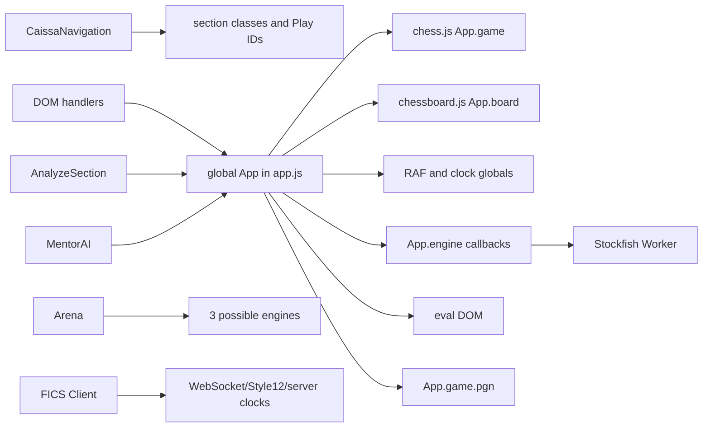
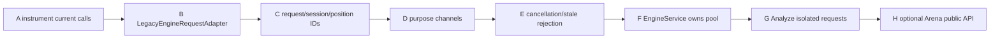
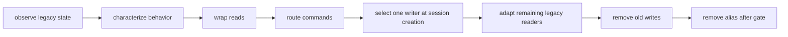
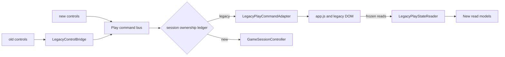
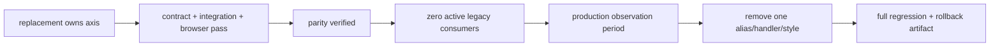

# CAISSA Play Migration and Compatibility Plan

Status: Season 10.0.3 implementation plan

Baseline: `4255936c957717cefa5fdf6dc0fe63ed3ce44fb2`

## 1. Executive Summary

This plan converts the current-state audit and Simplified Play blueprint into independently reviewable repository tasks. It does not implement them.

Migration begins with a browser characterization harness, then introduces read-only legacy projections and a single command bridge. Ownership moves one axis at a time: records, engine requests, fair-play/evaluation, local lifecycle, Analyze handoff, routes, shell, panels, then legacy removal. A session chooses exactly one writer when created; feature flags never switch ownership mid-game.

The highest-risk facts confirmed in source are:

- `app.js` owns mutable chess, board, mode, history, clocks, results, evaluation, promotion and up to three Play engines;
- `ensurePlayInitialized()` re-calls listener setup;
- EngineAdapter and the legacy Stockfish wrapper replace `onInfo`/`onBestMove`;
- Analyze assigns its chess object to `App.game` and operates `App.board`;
- navigation changes DOM section state without browser history and leaves Play resources alive;
- Arena creates white, black and evaluator engines independently;
- FICS is a separate WebSocket/server-authority runtime;
- late `styles.css` layers repeatedly override Play and mobile geometry.

No task may combine engine ownership, lifecycle ownership, routing, layout and mobile CSS. Characterization is the first runtime task and blocks all ownership changes.

## 2. Repository Baseline

| Item | Verified value |
|---|---|
| Branch | `main` |
| Initial HEAD | `4255936c957717cefa5fdf6dc0fe63ed3ce44fb2` |
| Local `origin/main` | `eb0511043dd397ac6ff50f05b4e67a84144b5d78` |
| Ahead / behind | 2 / 0 |
| Working tree | Clean |
| Local commit 1 | `32a1487` — `docs(play): audit current play architecture for season 10` |
| Local commit 2 | `4255936` — `docs(play): define simplified play architecture` |

Both commits are local-only relative to the recorded `origin/main`. The two authoritative documents were tracked and unchanged at pre-flight.

## 3. Authoritative Sources

Primary:

- [Play current-state audit](./PLAY_CURRENT_STATE_AUDIT.md)
- [Simplified Play architecture](./CAISSA_SIMPLIFIED_PLAY_ARCHITECTURE.md)

Reused contracts:

- [Board Interaction API v1](./CAISSA_BOARD_INTERACTION_API_V1.md): immutable move intent, one controller per board, idempotent disposal.
- [Workspace Guidelines](./CAISSA_WORKSPACE_GUIDELINES.md): board first, one owner, persistent board, progressive disclosure.
- [Coaching v1](./ENDGAME_COACHING_V1.md): deterministic classification/hints.
- [Training Memory v1](./ENDGAME_TRAINING_MEMORY_V1.md): validated educational history; no board/engine/DOM dependency.
- Knowledge release and learning-consent architecture: immutable release pins; no UI-derived Mastery.
- `docs/CAISSA_CLASSIC_ARCHITECTURE.md`: Classic reuses FICS core and does not duplicate protocol.
- existing Analyze, navigation, FICS, Arena and Endgame runtime/tests.

When this plan names future behavior, it is a proposal. Only current source behavior is described as existing.

## 4. Migration Principles

1. Characterize before changing.
2. Wrap reads before routing commands.
3. Route commands before transferring writes.
4. One authoritative writer per session and ownership axis.
5. Adapters are versioned, observable and removable.
6. Board API v1 is the interaction boundary; no new Play-specific tap implementation.
7. Engine requests carry session, purpose, request and position identity.
8. FairPlayPolicy authorization occurs inside EngineService.
9. Analyze receives immutable data and creates independent state.
10. FICS remains externally authoritative; Arena remains outside Play.
11. Default exposure stays legacy/off until gates pass.
12. Storage changes are versioned, additive and non-destructive.
13. Each task is one commit-sized ownership change with a rollback flag or revert.

## 5. Scope and Non-Goals

In scope: exact files, globals, DOM/listeners/resources, future module paths, adapters, tasks, tests, flags, rollback, removal gates, risk and product-decision impact.

Not in scope: any runtime/test/HTML/CSS/package change; route implementation; modules; dependency installation; visual design; multiplayer; FICS protocol; engine tuning; product catalog; push/deploy.

## 6. Current Runtime Reinspection

| File | Current responsibility and state | Listeners/timers/workers/storage/DOM | Migration phase | Risk |
|---|---|---|---|---|
| `index.html` | Entire SPA and Play/Analyze/FICS/Arena markup; script order | `#playSection`, `#chessboard`, eval, clocks, panels, controls, modals; legacy duplicate IDs/panels | shell | High |
| `app.js` | Global Play rules/view/session/engine/eval/editor/PGN and unrelated Insights | DOMContentLoaded; window resize/orientation; board click/touch; document click/keydown; modal/control handlers; RAF clock; Play/EVE workers; several localStorage keys | phases 1–9 | Critical |
| `styles.css` | All application and repeated Play/mobile layers | Play rules near 349–551, 4,887+, 5,509+, 8,053–8,834; safe areas and landscape overrides | shell/mobile | High |
| `js/caissa-navigation.js` | current section, Classic default, mobile actions/section hooks | nav/document clicks, keydown; localStorage `caissa_nav_state`; calls board resize/Play init | routes | High |
| `js/engine-adapter.js` | worker wrapper and mutable UCI callbacks | one Worker; `onmessage`; mutable callbacks; delayed termination | engine | Critical |
| `stockfish-worker.js` | legacy fallback with parallel mutable API | one Worker; same callback pattern | engine removal | High |
| `js/engine-registry.js` | engine metadata/factory | reads `window.EngineAdapter` | engine | Medium |
| `polyglot-book.js`, `book.bin` | current bot opening selection | fetch/book memory | Bots | Medium |
| `js/analyze-section.js` | import/study/full-game/live Analyze | many control listeners and document keydown; its engine; writes `App.game`, flags/history and board | Analyze | Critical |
| `js/caissa-arena.js`, `js/arena-section.js` | separate engine tournament UI | white, black and evaluator engines; Arena listeners | external later | High |
| `js/fics-client.js`, `js/fics-style12.js` | WebSocket, server state, board, clocks, moves, promotion, PGN | extensive controls/document keydown; WebSockets; `caissaFicsSoundsEnabled` | remain external | High |
| `mentor-ai.js` | Mentor panel/context/provider | panel/form listeners; reads `App.game.pgn/fen/eval`; provider settings storage | Mentor | High |
| `js/academy-section.js` | mentor/course selection shell | Academy listeners; selection/profile storage | Mentor/Coach link | Medium |
| `js/caissa-board-interaction.js` | stable shared input controller | consumer-owned, disposable | board adapter | Low |
| `js/endgame-trainer/safe-engine-adapter.js` | proven request/transport replacement patterns | tokens/timeouts/termination | reference, not direct reuse assumption | Low |
| `tests/*` | strong Endgame/Knowledge/static coverage, no core Play browser suite | Playwright exists but Play fixtures/specs do not | phase 1 | Critical gap |

Current ownership flow:

## 7. Legacy Global Inventory

| Global / Shared State | Defined In | Read By | Written By | Current Owner | Future Owner | Migration Method | Removal Gate |
|---|---|---|---|---|---|---|---|
| `App.game` | `app.js` | Play, Analyze, Mentor | Play + Analyze | shared global | GameSessionController; Analyze own state | read adapter, then direct replacement | no Analyze/consumer direct use; move parity |
| `App.board` | `app.js` | Play, navigation, Analyze | board init; Analyze commands | Play global | ChessboardAdapter | LegacyBoardAdapter | one mount/dispose/resize authority |
| `CaissaNavigation.currentSection` | navigation | shell/modules | navigation | navigation global | PlayRouteController | LegacyNavigationAdapter | URL/history tests and no direct consumers |
| `App.gameMode`, `engineEnabled`, `enginePlaysAs` | `app.js` | input/engine/UI/Analyze | New Game/Analyze/EVE | Play global | GameConfiguration + Lifecycle | state reader/command bridge | lifecycle owns transitions |
| `App.playerColor`, `timeControl`, `engineId`, `chess960Enabled` | `app.js` | New Game/engine/UI | modal/storage | Play global | configuration/registries | read adapter then config command | profile/config parity |
| `App.moveHistory`, `currentMoveIndex` | `app.js` | list/navigation/Analyze | Play + Analyze | shared global | GameSessionController | mirrored read-only projection | one rules-derived history |
| white/black time/ms and clock flags/IDs | `app.js` | UI/result | clock functions/Analyze flags | Play global | ClockService | LegacyClockAdapter | fake-clock parity; no RAF globals |
| `App.gameActive`, `gameStatus` | `app.js` | UI/input/navigation | New Game/result/timeout/resign | Play global | GameLifecycle | LegacyResultAdapter | all terminal cases normalized |
| `App.engine`, `engineWhite`, `engineBlack` | `app.js` | Play/EVE | init/change/EVE | Play global | EngineService | LegacyEngineAdapter | no direct Worker/EngineAdapter callers |
| EngineAdapter `onInfo`, `onBestMove` | engine adapters | Play/Analyze/Arena | each request caller | callback slot | request handles | compatibility request wrapper | callback assignments absent |
| `App.analyzing`, `currentEvaluation`, `lastEvalCp/Mate` | `app.js` | UI/Mentor/navigation | engine callbacks | Play global | EvaluationService | mirrored snapshot | policy/service/rail parity |
| current FEN/PGN | derived from `App.game`; Mentor fields | Play/Analyze/Mentor | chess.js/Mentor | derived/shared | session snapshot/record | immutable snapshot | no global handoff |
| Analyze loaded game/results/tokens | Analyze object | Analyze | Analyze | Analyze | Analyze isolated state | direct replacement | no `App.*` writes |
| `App.pendingPromotion` | `app.js` | input/modal/Analyze reset | drop/modal/Analyze | Play global | GameLifecycle + dialog | command adapter | promotion tests and no alias |
| `App.mobileTapSource/Targets`, drag flags | `app.js` | mobile input | board handlers/Analyze reset | Play global | ChessboardAdapter/Board API | LegacyBoardAdapter | Board API parity |
| `App.isFlipped`, layout pending | `app.js` | board/eval/navigation | flip/init | Play global | ChessboardAdapter/UI | read adapter | ResizeObserver/orientation parity |
| `App.elements` | `app.js` | all Play functions | cacheElements | DOM cache | shell view bindings | deprecated alias | no runtime reads |
| `caissa.engineId`, `caissa.chess960`, `caissa.openingDebug` | localStorage | `app.js` | `app.js` | direct storage | PersistenceAdapter/preferences | read migration | versioned preferences |
| `caissa_nav_state` | localStorage | navigation | navigation | navigation | route/UI persistence | compatibility read | canonical route owns mode |
| `caissaFicsSoundsEnabled` | localStorage | FICS | FICS | FICS external | remain FICS | remain external | not removed by Play |
| Mentor settings/context | `mentor-ai.js` | Mentor | Mentor | Mentor | MentorReviewGateway/provider | immutable record gateway | no live `App` dependency |
| Academy selections/profile | Academy | Academy | Academy | Academy | remain Academy / registry input | remain external | separate decision |
| CSS classes/DOM visibility | HTML/CSS/scripts | UI logic | many modules | presentation as state | SimplifiedPlayShell | read adapter then replacement | no domain reads from DOM |
| listener/mount sentinel state | closures/DOM markers | setup | setup | fragmented | mount/disposal registry | single-write bridge | repeated-entry zero growth |

No mirrored field becomes authoritative. Shadow records may compare output, but legacy remains the only writer until a task explicitly transfers that axis.

## 8. DOM Ownership Inventory

| Element / Selector | Created By | Updated By | Listener Owners | Future Module | Migration Risk |
|---|---|---|---|---|---|
| `#playSection`, `.cais-root/.cais-stage` | `index.html` | navigation/CSS | navigation | SimplifiedPlayShell | High |
| `#chessboard`, board wrapper/container | HTML + chessboard.js children | app/Analyze/navigation | board/app/Analyze | ChessboardAdapter/PlayBoardStage | Critical |
| `#evalBar/#evalFill/#evalScore`, `#evalNumeric` | HTML | app engine/eval functions | none/direct controls nearby | EvaluationRail | High |
| `#topClockWhite/#topClockBlack/#whiteTime/#blackTime` | HTML | app timers | none | ClockDisplay | High |
| player/status nodes (`player*`, `gs-*`, `gameStatusText`) | HTML | app status | result/control handlers | PlayerHeader/PostGame | High |
| `#movesPanel`, navigation buttons, legacy history | HTML | app | click handlers | Game history view | High |
| `#btnResign/#btnUndo/#btnHint/#btnDownload/#btnSettings/#navNewGameBtn` | HTML | app/navigation | app/navigation | BoardActions/panels | High |
| `#newGameModal/#startNewGame`, options | HTML | app | modal/direct handlers | GamesPanel/dialog | High |
| promotion modal/buttons | HTML | app | app | ChessboardAdapter dialog port | Critical |
| editor/analysis/opening/coach panels | HTML | app | app | Advanced/Analyze/Coach | High |
| `.mobile-quick-actions`, mobile analysis sheet | HTML | navigation/app | navigation | shell mobile actions | High |
| `#analyzeSection` and Analyze board/list/import controls | HTML | Analyze | Analyze | existing Analyze + handoff reader | Critical |
| hidden compatibility buttons/panels | HTML | app | app | LegacyControlBridge | High |

Old DOM stays mounted until its control and view parity gate passes. Hidden legacy elements must be inert and unfocusable during dual-presentation QA.

## 9. Listener and Resource Inventory

| Event | Target | Handler | Registration Location | Cleanup Exists | Duplicate Risk | Future Owner |
|---|---|---|---|---|---|---|
| DOMContentLoaded | document | app bootstrap | `app.js:215` | page lifetime | Low | application bootstrap |
| DOMContentLoaded | document | nav/Analyze/FICS init | respective files | page lifetime | Medium if scripts reloaded | module bootstraps |
| resize | window | debounced board resize | `app.js` board init | No | Medium | ChessboardAdapter ResizeObserver |
| orientationchange | window | board resize/visibility | `app.js` | No | Medium | shell/stage |
| touchmove/click/touchcancel | `#chessboard` | scroll/tap selection | board init | No | Low per board, high remount | Board API/adapter |
| click | document | clear tap/modal/nav dismissal | app/navigation | No | Medium | shell/board adapter |
| keydown | document | shortcuts/modal/Analyze/FICS | multiple files | partial Analyze guard only | High conflict | scoped modules/dialog service |
| click/change/input | Play controls/modals | setup/direct handlers | `setupEventListeners` and setup helpers | mixed `safeOn`, mostly no unbind | High | LegacyControlBridge then panels |
| drag/drop callbacks | chessboard.js | `onDragStart/onDrop/onSnapEnd` | board config | board library lifecycle | Medium | ChessboardAdapter |
| message/error | engine Worker | adapter message handlers | EngineAdapter/legacy worker | terminate only | High stale callback | EngineService |
| animation frame | window | `clockTick` | `startTimer` | common stop paths | Medium | ClockService |
| timeout | window | init polling/resizes/engine/book/moves | app/Analyze/adapters | partial | Medium | owning service/disposable scheduler |
| WebSocket events | FICS sockets | FICS client | `js/fics-client.js` | client disconnect | external | FICS |

Resource invariants for future tests: one local board mount; listener counts stable over 20 enter/exits; zero Play RAF after dispose; expected worker maximum; all request handles terminal; no late response changes state.

## 10. Engine Migration Map

Current creation sites:

- Play `App.engine` via `createEngineInstance`;
- EVE `App.engineWhite` and `App.engineBlack`;
- Analyze `analysisEngine`;
- Arena white/black/evaluator engines;
- Opening Database separate move/eval clients;
- Endgame uses its own SafeEngineAdapter/factory;
- FICS has no Play engine dependency.

Current opponent search and evaluation share mutable callback properties. Search IDs exist but EngineAdapter does not validate them in message dispatch. New Game stops/resets without recreating the normal worker; leaving Play retains it.

| Stage | Files modified later | Identical behavior target | Tests | Rollback | Stop condition |
|---|---|---|---|---|---|
| A | tests/harness, diagnostics only | all current calls | worker count/callback traces | remove instrumentation | nondeterministic harness |
| B | new engine request adapter, `app.js` call sites | same commands/results | parity fake worker + browser | route to existing adapter | any move divergence |
| C | adapter/service schemas | same strength/timing | stale IDs, duplicate IDs | IDs ignored behind flag | caller lacks position token |
| D | adapter + opponent/eval callers | same visible results | simultaneous-purpose tests | serialize through legacy path | callback overwrite remains |
| E | adapter/service | same accepted current result | cancel/reset/leave/late messages | legacy request flag | late result commits |
| F | EngineService, registry bridge | same engine configuration | pool/start/crash/terminate/mobile cap | session selects legacy owner | worker leak/count failure |
| G | Analyze + Analyze adapter | same Analyze output | coverage/retry/independent state | legacy manual import | Play mutation observed |
| H | Arena only, later | Arena unchanged | three-purpose Arena suite | Arena keeps current engines | Play regression or API mismatch |

Direct Worker construction remains allowed in external Endgame/Opening DB until separately migrated; it cannot bypass Play FairPlayPolicy for Play purposes.

## 11. Game-State Ownership Migration

| Ownership Axis | Current Owner | Compatibility Adapter | New Owner | Transfer Task | Verification Gate | Removal Task |
|---|---|---|---|---|---|---|
| position/rules | `App.game` + Analyze | LegacyPlayStateReader/command adapter | GameSessionController rules port | 10.0.9 | chess correctness + one move | remove Play/Analyze writes |
| move history | `App.moveHistory` + chess history | state reader | GameSessionController | 10.0.9 | PGN/navigation parity | remove parallel array writes |
| clocks | app RAF globals | LegacyClockAdapter | ClockService | 10.0.9b | fake-clock/timeout parity | remove RAF fields/functions |
| result/status | app strings | LegacyResultAdapter | GameLifecycle/RecordService | 10.0.6 then 10.0.9 | all termination fixtures | remove string-authority paths |
| promotion | `App.pendingPromotion` | command adapter | lifecycle + board dialog port | 10.0.9 | four choices/cancel/reset | remove global |
| PGN | `App.game.pgn`, FICS PGN | record builder; FICS remains external | GameRecordService | 10.0.6 | byte/semantic parity | remove local ad-hoc export source |
| engine requests | callbacks/engine globals | LegacyEngineRequestAdapter | EngineService | 10.0.7 | stale/cancel/pool | remove direct callbacks |
| evaluation | app eval globals/DOM | LegacyEvaluationReader | EvaluationService | 10.0.8/10.1.3 | policy + orientation/state | remove direct eval DOM writes |
| board rendering | `App.board` | LegacyBoardAdapter | ChessboardAdapter | 10.1.1b | Board API/device/resize | remove initializeBoard |
| persistence | direct localStorage; no game recovery | PersistenceAdapter shadow | PersistenceAdapter | 10.0.6b | corruption/atomic/consent | remove direct Play preferences/record writes |
| Analyze handoff | shared `App.game/board` | LegacyAnalyzeHandoffAdapter | AnalyzeHandoff | 10.0.10 | immutable/cold/back/expiry | remove Analyze `App` mutation |

Transfer order for every row: observe -> characterize -> read adapter -> command route -> select new writer at session creation -> adapt legacy readers -> remove old writes -> remove alias. Dual writes are allowed only for non-authoritative record comparison with no consumer.

## 12. Characterization Test Plan

First task creates `tests/browser/play-characterization.spec.js`, `tests/play/play-static-contract.test.js`, `tests/play/fixtures/`, and reusable Playwright helpers. It may minimally instrument tests through page injection; no production code changes.

| Coverage | Type/file | Harness/fixture | Deterministic strategy | Blocks |
|---|---|---|---|---|
| Classic cold load; `?section=play`; navigation/re-entry | browser spec | local server + Playwright | network fixtures | all |
| one board creation/render | browser | DOM/mutation counters | fixed viewport | all |
| legal/illegal, drag, click/tap | browser | fine/coarse contexts | fixed starting FEN | lifecycle/shell |
| engine reply/evaluation/stale callback | integration/browser | injected fake Worker UCI transcript | deterministic bestmove/info delays | engine |
| promotion | browser | promotion FENs, each piece/cancel | no engine | lifecycle |
| flip/resize/orientation/mobile sizes | browser | 9 required viewports | screenshot-free geometry assertions | UI/mobile |
| New Game/reset/repeated entry | browser | listener/move counters | fake worker | adapters |
| mate/stalemate/resign/timeout | integration/browser | FEN/move/fake clock fixtures | virtual time | records/lifecycle |
| PGN generation | integration/static | expected semantic PGN | normalized headers/moves | records |
| Analyze open/current mutation | browser | snapshot identity/projection probes | known PGN | Analyze |
| worker/listener/timer counts and leave cleanup | browser | constructor/listener/RAF probes | controlled navigation loop | ownership |

Illegal-move behavior is characterized, not legitimized if defective. Assertions distinguish current known behavior from target requirements. Every listed row is a blocker for its downstream phase; board/move/resource basics block all visual work.

## 13. Proposed Module File Map

Repository convention favors cohesive ES modules under `js/`; proposed Play files live under `js/play/`.

| Proposed File | Responsibility | Initial Consumers | Legacy Dependency | First Task Introduced | Test File |
|---|---|---|---|---|---|
| `js/play/legacy-play-compatibility.js` | read/command/control adapters + ownership ledger | tests/app | `window.App`, IDs | 10.0.5 | `tests/play/legacy-play-compatibility.test.js` |
| `js/play/play-route-controller.js` | canonical/legacy routes/history | shell/navigation | CaissaNavigation | 10.1.1a | `tests/play/play-route-controller.test.js` |
| `js/play/simplified-play-shell.js` | composition/mount/dispose | entry | legacy section initially | 10.1.1 | `tests/play/simplified-play-shell.test.js` |
| `js/play/play-board-stage.js` | stage/read models/resize allocation | shell | current DOM | 10.1.1b | `tests/play/play-board-stage.test.js` |
| `js/play/chessboard-adapter.js` | Board API v1 and chessboard.js view | session/stage | `App.board` temporarily | 10.1.1b | `tests/play/chessboard-adapter.test.js` |
| `js/play/game-lifecycle.js` | pure state transitions/results | controller | none | 10.0.9 | `tests/play/game-lifecycle.test.js` |
| `js/play/game-session-controller.js` | command orchestration/rules ownership | panels/board | command adapter during cutover | 10.0.9 | `tests/play/game-session-controller.test.js` |
| `js/play/clock-service.js` | monotonic local clock | session/display | clock adapter | 10.0.9b | `tests/play/clock-service.test.js` |
| `js/play/engine-service.js` | purpose requests/bounded pool | session/evaluation | EngineAdapter transport | 10.0.7 | `tests/play/engine-service.test.js` |
| `js/play/fair-play-policy.js` | pure decisions | EngineService | none | 10.0.8 | `tests/play/fair-play-policy.test.js` |
| `js/play/evaluation-service.js` | normalized eval snapshots | rail/session | engine adapter during cutover | 10.0.8 | `tests/play/evaluation-service.test.js` |
| `js/play/evaluation-rail.js` | accessible render-only rail | stage | legacy DOM initially | 10.1.3 | `tests/play/evaluation-rail.test.js` |
| `js/play/game-record-service.js` | validate/build records | lifecycle/post-game | `App.game.pgn` reader | 10.0.6 | `tests/play/game-record-service.test.js` |
| `js/play/play-persistence-adapter.js` | preferences/recovery/records | record/session | localStorage | 10.0.6b | `tests/play/play-persistence-adapter.test.js` |
| `js/play/analyze-handoff.js` | TTL immutable transport | post-game/Analyze reader | sessionStorage | 10.0.10 | `tests/play/analyze-handoff.test.js` |
| `js/play/post-game-experience.js` | completed-game actions | shell | legacy result view | 10.1.4 | `tests/play/post-game-experience.test.js` |
| `js/play/bot-registry.js` | BotProfile validation/query | BotsPanel/session | engine registry IDs | 10.2.1 | `tests/play/bot-registry.test.js` |
| `js/play/coach-registry.js` | CoachProfile/config | CoachPanel | coaching contract | 10.3.1 | `tests/play/coach-registry.test.js` |
| `js/play/mentor-review-gateway.js` | completed-game review orchestration | post-game | Analyze/Mentor/Knowledge adapters | 10.4.1 | `tests/play/mentor-review-gateway.test.js` |
| `js/play/fics-play-adapter.js` | external read model/record adapter | PlayersPanel | FICS client | later 10.5 | `tests/play/fics-play-adapter.test.js` |

PlayModeNavigation, context panels, PlayerHeader, ClockDisplay and BoardActions should initially remain cohesive render helpers inside shell/panel files; split only when independent lifecycle/testing justifies it.

## 14. Compatibility Adapters

| Adapter | Flow / writes | Lifetime | Prohibited use | Tests | Removal gate/phase |
|---|---|---|---|---|---|
| LegacyPlayStateReader | legacy -> frozen snapshot; read-only | until lifecycle consumers migrate | exposing objects/DOM | cloning/schema/parity | no consumers; phase 15 |
| LegacyPlayCommandAdapter | commands -> narrow existing functions | per legacy-owned session | direct new-state write | one dispatch/command parity | new controller owns all commands |
| LegacyControlBridge | old IDs -> command bus; bind/unbind once | old UI | behavior implementation | repeated mount/listener counts | hidden controls removed |
| LegacyBoardAdapter | snapshot/orientation/resize -> `App.board` | until ChessboardAdapter cutover | rules/session/engine | render/resize/dispose | Board API adapter owns mount |
| LegacyEngineRequestAdapter | request envelope -> existing adapter | engine stages B–F | callback use by new callers | ID/purpose/parity | EngineService owns transport |
| LegacyClockAdapter | clock snapshot/commands -> old functions | until clock cutover | two RAF writers | virtual-time parity | ClockService owns |
| LegacyResultAdapter | current strings -> normalized shadow record | record/lifecycle stages | changing legacy result | all terminal fixtures | lifecycle/record authoritative |
| LegacyAnalyzeHandoffAdapter | current PGN/FEN -> immutable payload | Analyze transition | passing `App.game/board` | clone/corrupt/back | Analyze consumes only v1 |
| LegacyNavigationAdapter | canonical intents -> current section API | route transition | device-specific default | cold/history/fallback | canonical router owns |

Every adapter appears in an ownership ledger containing introduced task, current consumers, authoritative direction and removal issue. CI eventually fails on new imports after deprecation.

## 15. Route Migration

Current: `?section=play`, Play nav buttons, New Game navigation; Classic default; no pushState/popstate; `?fen`, `?embed`, `?debug`; path mappings for Classic/Academy.

Target: `/play`, `/play/games`, `/play/bots`, `/play/coach`, `/play/players`.

Stages:

1. characterize current cold loads and navigation;
2. pure route resolver tests;
3. LegacyNavigationAdapter resolves canonical intent to current section without URL changes;
4. internal QA route/query exposes shell with legacy default;
5. PlayRouteController adds history/back/fallback;
6. canonical links ship while legacy queries adapt;
7. retain legacy links for two stable releases;
8. remove only after zero-use observation.

Classic remains default. Mobile uses identical route truth. Unknown Play mode falls to Games with notice. Analyze return stores a validated return route. Each stage is a separate commit and can revert to `CaissaNavigation`.

## 16. UI and Board-First Shell Migration

```mermaid
flowchart LR
    Legacy[Legacy cockpit default] --> Flag[QA-only shell flag]
    Flag --> Board[legacy board mounted in new stage]
    Board --> Controls[compatibility controls]
    Controls --> Games[GamesPanel]
    Games --> Advanced[Advanced options]
    Advanced --> Rail[EvaluationRail]
    Rail --> Post[Post-game]
    Post --> Bots[Bots]
    Bots --> Coach[Coach]
    Coach --> Players[Players/FICS link]
    Players --> Default[verified shell default]
```

At every stage the old UI remains available. New exposure is QA-only until desktop/mobile/function/accessibility parity. The shell initially renders frozen legacy reads and dispatches the same commands; it does not own the game. Board mount transfer is its own task. Games migrates only evidenced quick-machine setup/records. Secondary controls move only after command parity. Bots/Coach/Players wait for foundations.

Rollback selects legacy presentation before session creation. Legacy removal requires section 30 gates and an observation release.

## 17. Mobile and Responsive Migration

Current conflicts are concentrated in `styles.css`: generic board/eval rules; early 768/480 breakpoints; Play layout around 4,887–5,675; sidebar changes around 6,500; mobile quick actions around 7,647; normalization around 8,053; final mobile/landscape overrides around 8,304–8,834.

Dedicated sequence:

1. geometry-only assertions at 320x568, 375x667, 390x844, 412x915, 768x1024, 1024x768, 1366x768, 1440x900, 1920x1080;
2. scope legacy rules under legacy root without changing computed output;
3. new shell tokens in isolated root;
4. one ResizeObserver authority in PlayBoardStage/ChessboardAdapter;
5. stable rail width inside board-stage sizing;
6. portrait board-first stack and one sticky action region;
7. landscape adaptive split only when minimums fit;
8. keyboard/modal/drawer/focus tests;
9. deprecate late legacy selectors only after computed-style parity.

Safe-area insets, visual viewport, square sizing and panel scroll are shell contracts. Desktop shell and mobile CSS changes are separate commits. No screenshot artifacts are required; geometry assertions and optional reviewed screenshots stored only when a later task authorizes them.

## 18. Analyze Isolation Plan

```mermaid
flowchart LR
    A[characterize App mutation] --> B[AnalyzeHandoffV1 validator]
    B --> C[immutable serializer]
    C --> D[token + sessionStorage TTL]
    D --> E[Analyze reader, legacy still default]
    E --> F[compare imported PGN/FEN]
    F --> G[Analyze independent Chess instance]
    G --> H[remove App.game/board writes]
    H --> I[deprecate legacy adapter]
```

Files later: `js/play/analyze-handoff.js`, `js/analyze-section.js`, `js/caissa-navigation.js` or route controller, post-game caller, focused tests.

Corrupt/oversize/expired payloads are rejected and deleted or quarantined; Analyze opens normal import with a message. Back uses a validated return route. Cold load consumes a tab-local token; missing token does not fabricate a game. Default TTL and size are constants tested at boundaries. Consume/delete is idempotent. Dual comparison may parse both copies but only legacy drives UI until parity; never let both mutate state.

## 19. Fair-Play Enforcement Migration

1. inventory/characterize every Play, Analyze, Arena and external engine entry;
2. introduce pure policy matrix in audit mode for current bot/analysis calls;
3. add development decision events;
4. require `PolicyDecision` in compatibility request wrapper;
5. deny unknown human/FICS sources by default;
6. migrate opponent then evaluation then post-game callers;
7. enforce inside EngineService before queue/worker;
8. prohibit new direct engine imports through static tests;
9. remove direct Play calls.

Audit mode may report would-deny but cannot expose future Players/FICS until enforcement mode tests prove forbidden requests never create/post to a Worker. FICS remains deny-live regardless of UI. Arena is labeled engine-only and separate.

## 20. Game Record and Persistence Migration

Current sources: `App.game.pgn/fen/history`, `App.gameStatus`, local clocks; separate FICS PGN; no Play recovery. Existing localStorage keys are preferences/Insights, not completed-game records.

Stages:

1. pure read-only `CompletedGameRecordV1` builder;
2. validator and termination enum;
3. shadow comparison against legacy PGN/FEN/result (no consumer);
4. PostGame/Analyze consumers use frozen records;
5. configurable bounded guest history after owner consent decision;
6. separate atomic recovery snapshot;
7. explicit version migrations/rejections;
8. remove ad-hoc local record paths.

Corrupt/unsupported storage never mutates active state. Retention and guest consent are configuration/product decisions. No existing Insight/Training Memory key is repurposed. Rollback ignores new namespaces without deleting them.

## 21. Bots Introduction Plan

Blockers: lifecycle, EngineService, FairPlay/evaluation, records, reset/rematch and resource cleanup all stable. Task order: BotProfile schema/registry -> legacy default profile -> engine-preset translation -> deterministic behavior tests -> BotsPanel -> optional catalog/assets/unlocks after owner approval. UI never contains engine parameters. Estimated rating remains labeled uncalibrated.

## 22. Coach Introduction Plan

Blockers: Bots foundation, CoachProfile/SessionConfig, deterministic coaching contract, controlled pause/input/clock semantics, intervention events and fair-play decisions. Order: registry -> Silent/Light behavior -> event timing -> Guided/Teaching only after explicit clock decision -> CoachPanel -> consented terminal summary adapter. Coach never writes Mastery or acts as Mentor.

## 23. Mentor Review Introduction Plan

Blockers: immutable records, isolated Analyze handoff, critical-moment input schema, consent/persistence boundaries and pinned Knowledge releases. Order: request/result validator -> Analyze evidence adapter -> bounded critical moments -> released Knowledge mapping -> explanation -> one recommendation signal -> optional consented learning summary. No live-board dependency; partial/error states must be truthful.

## 24. Players and FICS Boundary

Season 10 may add FairPlayPolicy classification, a read-only FICS presentation/record adapter, and a Players link after gates. It may not change WebSocket/protocol/Style12, server clocks/results/reconnect, credentials, or Classic consumption. No live engine/hints. FICS adapter fixtures block exposure.

## 25. Arena Boundary

Arena remains outside Play. Foundational tasks must not alter Arena. After EngineService stabilizes, a separate Arena task may replace its white/black/evaluator engine creation using public engine-purpose contracts with Arena-specific tests and rollback. Arena failure never blocks Simplified Play shell work; Play must not import Arena.

## 26. Feature-Flag and Exposure Strategy

Safest repository-compatible approach: a non-persisted, allowlisted QA query flag on the existing local/preview URL, combined with an internal runtime configuration defaulting false. Do not add a primary navigation item initially. Avoid localStorage flags because they become stale across releases and leak between tests.

Default/prod: legacy. QA: explicit query on approved environments; production ignores it until release authorization. Ownership flag is captured at session creation. Rollback removes/turns off exposure without storage repair. Once shell is default for one observation release and rollback is retired, remove the flag and alternate branch together.

## 27. Implementation Tasks

| Task | Objective | Files Likely Touched | Prerequisites | Tests | Commit Boundary | Rollback Point | Stop Conditions |
|---|---|---|---|---|---|---|---|
| 10.0.4 Characterization Harness | deterministic current Play/browser/resource baseline | new Play tests/helpers; config only if essential | this plan | section 12 | tests only | revert test commit | cannot make engine deterministic without runtime change |
| 10.0.5 Compatibility Boundary | frozen reader, command/control bridge, ownership ledger | new compatibility module, minimal `app.js` exports, tests | 10.0.4 | parity/listener | adapters only, legacy default | disable imports | any double command |
| 10.0.6 Record Normalization | pure record/result builder in shadow | new record module/tests, minimal read adapter | 10.0.5 | PGN/all results | no consumer/write | remove shadow | semantic PGN mismatch unresolved |
| 10.0.6b Persistence Foundation | versioned adapter, no default game history | new persistence/tests | record validator | corruption/quota/atomic | unused adapter | ignore namespace | destructive migration needed |
| 10.0.7 Engine Request Isolation | request wrapper, IDs/purpose/cancel/stale gates | engine service, adapter/app call sites, tests | harness/compat | fake worker/browser/resource | opponent/eval ownership only | per-session legacy flag | chess move divergence |
| 10.0.8 FairPlay Foundation | mandatory decisions and eval snapshots | policy/eval/service/tests | EngineService | policy matrix/no Worker on denial | no UI layout | legacy bot-only session | direct Play caller remains |
| 10.0.9 Lifecycle Foundation | pure lifecycle/controller owns local state | lifecycle/controller/app bridge/tests | records/engine/policy | transitions/chess/reset | no route/layout | legacy session owner | dual writer detected |
| 10.0.9b Clock Transfer | ClockService owns local time | clock module/app bridge/tests | lifecycle | virtual time/timeouts | clock only | legacy owner per session | duplicate RAF |
| 10.0.10 Analyze Isolation | token handoff and independent Analyze state | handoff, Analyze, nav, tests | records/lifecycle | corrupt/cold/back/isolation | Analyze only | manual import/legacy path | any App mutation remains on new path |
| 10.1.1a Route Controller | pure/canonical routes behind QA exposure | route/nav/middleware tests as needed | harness | cold/history/legacy | routing only | CaissaNavigation | Classic default changes |
| 10.1.1b Board Adapter | Board API v1 mount/resize ownership | board/stage/app bridge/tests | lifecycle | input/promotion/resize | board only | legacy board owner | mobile regression |
| 10.1.1 Shell | board-first presentation with legacy commands | shell/HTML/new scoped CSS/tests | route/board/compat | parity/a11y/viewports | desktop shell; mobile separate | QA flag off | behavior or focus regression |
| 10.1.1m Mobile Shell | mobile/landscape/safe areas | scoped CSS/shell tests | desktop shell parity | nine viewports/device smoke | mobile only | QA flag off | clipping/duplicate sticky |
| 10.1.2 GamesPanel | existing quick machine setup/records | panel/shell/bridge/tests | lifecycle/records/shell | config/recovery | Games only | legacy modal | implies multiplayer |
| 10.1.3 EvaluationRail | render EvaluationSnapshot | rail/scoped CSS/tests | policy/evaluation/stage | states/a11y/orientation | rail only | legacy eval render | layout or policy mismatch |
| 10.1.4 PostGame | record-driven actions/rematch | post-game/shell/tests | records/Analyze/lifecycle | all actions/rematch | completed state only | legacy result UI | record loss |
| 10.2.1 Bots Foundation | profiles/presets/default Bot | registry/panel/service/tests | cleanup gates | validation/determinism | Bots only | default legacy Bot | uncalibrated claims |
| 10.3.1 Coach Foundation | session pedagogy | registry/panel/coaching/tests | Bots + pause policy | timing/silence/fair play | Coach only | disabled Coach | unsafe clock/input |
| 10.4.1 Mentor Foundation | consented post-game gateway | gateway/Analyze/Knowledge/tests | records/handoff/consent | partial/cancel/pinning | post-game only | hide action | learning-boundary violation |
| 10.5 FICS Presentation Adapter | external Players link/read model | FICS adapter/panel/tests | fair-play/shell | fixtures/disconnect/authority | no protocol changes | existing FICS nav | engine request reaches worker |
| 10.6 Legacy Cleanup | remove proven-unused globals/IDs/CSS/adapters | legacy files/tests | every gate | full suite/observation | one ownership axis per commit | previous release shim | active consumer found |

First runtime task: **10.0.4 Characterization Test Harness**.

## 28. Commit Strategy

One task/ownership axis per commit. Test and its minimal implementation land together after 10.0.4. Never combine engine, lifecycle, route, desktop layout or mobile CSS transfers. Suggested messages use `test(play):`, `refactor(play):`, `feat(play):`, or `fix(play):` and state the boundary. Each PR/commit records flag default, old/new owner, validation, rollback and removal issue.

## 29. Rollback Strategy

Test harness: revert only tests/helpers. Adapters: stop importing; legacy remains default. Engine/policy/lifecycle/clock: session-captured owner flag selects legacy before start. Analyze: normal manual import and legacy path remain. Shell/Games/Rail/PostGame/Bots/Coach/Mentor: QA exposure off hides new presentation/gateway.

Storage uses new versioned namespaces and additive migrations; rollback ignores them, never deletes or rewrites existing keys. No rollback changes owner mid-session or requires database repair.

## 30. Legacy Removal Gates

| Legacy item | Measurable gate |
|---|---|
| board initialization | Board API/adapter owns mount, input, promotion, resize; 20 re-entry cycles; device gate |
| direct engine callbacks/globals | all Play requests use handles; stale/worker tests; static no-assignment/import check |
| Play state globals | controller owns all commands; no direct writes; snapshot parity and soak |
| clock globals | one RAF/source; timeout parity; background/orientation tests |
| direct Analyze mutation | new path has zero `App` writes; handoff cold/back/corrupt tests |
| route handlers | canonical/legacy/history tests; two-release link support; observed zero legacy use |
| duplicate controls | replacement parity/a11y; no source queries; old controls inert first |
| legacy game-over UI | record/post-game all terminations and actions pass |
| obsolete CSS | scoped computed geometry parity at nine viewports; no selector consumers |
| compatibility adapters | ownership ledger zero consumers, static import gate, rollback retired |

## 31. Migration Risk Register

| Risk | Phase | Likelihood | Impact | Detection | Prevention | Recovery |
|---|---|---|---|---|---|---|
| dual ownership | adapters/lifecycle | High | Critical | ownership assertion | session-selected writer | legacy session flag |
| duplicate moves | board/commands | High | Critical | submission counter | one command bus | revert axis |
| duplicate clocks | clock | Medium | High | RAF/tick probe | one ClockService | legacy clock |
| stale engine request | engine | High | Critical | delayed fake output | identity/cancel checks | discard/restart |
| worker leak | engine/Arena | High | High | constructor/terminate counts | bounded pool/dispose | legacy owner/reload |
| listener leak | adapters/shell | High | High | 20-entry count | unbind registry | flag off |
| board reinitialization | shell/mobile | Medium | High | mutation/mount counter | one adapter mount | legacy board |
| lost PGN | records | Medium | Critical | semantic comparison | immutable record/shadow | retain legacy PGN |
| incompatible saved games | persistence | Medium | High | validator/migration fixtures | versioned additive store | ignore/quarantine |
| Analyze corruption | handoff | High | Critical | identity/state probes | deep clone/independent state | manual import |
| mobile regression | shell | High | High | geometry/device gates | scoped CSS/one resize | flag off |
| feature-flag drift | exposure | Medium | Medium | config tests | non-persisted flag | remove/disable |
| partial route migration | routes | Medium | High | cold/back matrix | pure resolver/legacy adapter | old navigation |
| FICS contamination | Players | Medium | Critical | fixture/policy tests | external boundary | existing FICS section |
| Arena regression | engine H | Medium | High | Arena suite | separate task/public API | current Arena engines |
| unauthorized assistance | policy | Medium | Critical | Worker post spy | decision required inside service | deny/disable caller |
| browser storage incompatibility | persistence | Medium | High | quota/corrupt/private mode | atomic bounded adapter | memory-only/legacy |
| incomplete cleanup | removal | High | Medium | static imports/diagnostics | ledger/removal gates | restore shim |

## 32. Product Decision Impact

| Decision | Impact | Safe default | Approval deadline |
|---|---|---|---|
| future default landing | does not block foundation; blocks default shell exposure | Classic | before making shell default |
| local human-v-human | later Games capability | unsupported | before its task |
| Arena public status | does not block; affects optional engine H/cleanup | remain separate | before Arena migration/removal |
| Bot catalog/art/unlocks | blocks Bots presentation only | one legacy default, no new claims | before 10.2.1 UI |
| Coach profiles | blocks Coach presentation | no Coach | before 10.3.1 |
| Teaching pauses clocks | blocks Teaching mode only | do not pause/ship Teaching | before Teaching |
| guest history consent | blocks default persistence, not record builder | recovery/history off pending decision | before 10.0.6b exposure |
| guest retention | configurable | conservative bounded value, not activated | before history exposure |
| Mentor retention | blocks persistence, not gateway prototype | no persisted review | before 10.4 persistence |
| FICS presentation timing | blocks Players exposure only | existing FICS nav | before 10.5 |
| assisted human casual | later product, not foundation | prohibited | before any design task |

## 33. Validation Strategy

Each task runs focused unit/integration/browser suites, navigation governance, `git diff --check`, syntax/lint/build hooks, and artifact/status checks. Ownership tasks add static prohibitions and resource probes. UI tasks add accessibility and nine-viewport gates. FICS live tests remain optional; fixture tests are blocking. No release claim relies on absent external services or unsupported physical-device automation.

Migration dashboards in development track session owner, board count, listener count, RAF count, worker count, requests by purpose, stale discards, record mismatches, adapter consumers and cleanup result.

## 34. Definition of Done

This plan is executable when every future task has files, prerequisites, tests, commit/rollback/stop boundaries; every state axis has one future owner; all adapters have removal gates; engine/fair-play/Analyze/FICS boundaries are mandatory; mobile is independently staged; and owner decisions are tied to deadlines.

Migration implementation is done only after legacy globals, callbacks, duplicate controls/listeners, direct Analyze mutation and obsolete CSS pass section 30 and are removed in axis-specific commits—while current chess behavior, Classic, FICS, Arena, Analyze and supported URLs retain verified behavior.

## 35. Proposed Next Task

**SEASON 10.0.4 — PLAY CHARACTERIZATION TEST HARNESS**

Exact boundary:

- create Play-only tests, fixtures and helpers under `tests/play/` and `tests/browser/`;
- use the existing Playwright/local server and dependencies;
- cover cold load, navigation, one board, New Game, legal/illegal drag/click/tap, deterministic engine reply/evaluation, promotion, flip/resize, nine viewports, reset, terminal results, PGN, Analyze mutation, repeated entry, listener/worker/RAF counts, stale callbacks and section-leave behavior;
- provide a fake UCI Worker through test harness injection, not production engine modification;
- document observed defects separately from intended target assertions;
- modify Playwright configuration only if essential and justified;
- do not change production runtime, HTML, CSS, routes, dependencies or behavior;
- stop if deterministic testing requires production instrumentation, if baseline behavior cannot be reproduced, or if existing critical failures make a trustworthy characterization impossible;
- produce one independently revertible test commit and no deployment.

The first follow-up implementation task after a passing harness is 10.0.5, Legacy Compatibility Boundary. No adapter or production module belongs in 10.0.4.
