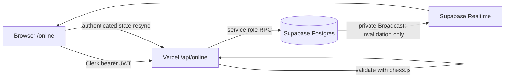

# Architecture and decisions

## Runtime shape

### ADR-001: database transaction as durable authority

Vercel Functions do not own durable WebSocket processes. The API therefore authenticates and validates commands, while Postgres RPCs lock and commit the canonical version, clock and event atomically. Supabase Realtime Broadcast is an authenticated invalidation channel. Every notification causes an authenticated state fetch; polling is the recovery path. The transport is never the source of truth.

Rejected alternative: an in-memory Vercel game server. It would lose authority on cold starts and could split state across instances.

### ADR-002: optimistic presentation, pessimistic state

The browser validates a candidate with the pinned chess.js build and moves the persistent renderer immediately. The request retains the last canonical FEN and version. A rejection restores that snapshot and performs a full state sync. Clocks, ratings, result and persisted PGN are never accepted from the browser.

### ADR-003: separate `/online` surface

The new route does not revive or modify the retired `/play` contract. It reuses the board adapter, Quiet Drag behavior, Clerk client and Analyze destination, but has independent CSS, controller state and rollout flags.

### ADR-004: intentionally small public surface

The browser receives a public capability document, authenticated per-user state, and private Broadcast notifications. Direct table writes and gameplay RPC execution are revoked from `anon` and `authenticated`; only the server's service role may execute mutations. Participant game SELECT exists solely to authorize private Realtime topics.

## Ownership

| Concern | Owner |
|---|---|
| Identity | Clerk JWT verified by the shared auth layer |
| Legal move/result | `api/_lib/online-game-engine.js` using chess.js 1.4 |
| Clock | Server timestamp plus locked database clock anchor |
| Version/idempotency | Postgres game row and event key |
| Cross-path pairing exclusion | Participant advisory locks plus active-game recheck |
| Rendering/input | Persistent CAISSA board adapter |
| Notification | Private Supabase Broadcast |
| Recovery | Authenticated state polling |
| Rating | `caissa-elo-v1`, applied exactly once in the result transaction |
| Abuse limiting | Local fast path plus shared transactional per-user buckets |

## Tournament and multiboard foundation

The schema models official/community events, Arena/Swiss/Round Robin formats, participants, standings fields, rounds, boards, late join and capacity. `js/online/online-tournaments.js` provides stable presentation contracts and featured-board selection. All public tournament, spectator and multiboard capabilities default off. Pairing engines, organizer controls, anti-abuse review and read-only public projection are explicit follow-up work.
