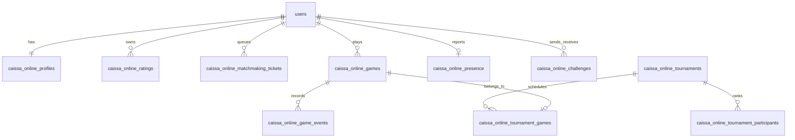

# Data model

The migration is `supabase/migrations/20261005204209_caissa_online_native_v1.sql`.

## Tables

- `caissa_online_profiles`: stable display identity mapped to the existing `users` row.
- `caissa_online_ratings`: per-pool rating and W/D/L counters.
- `caissa_online_matchmaking_tickets`: expiring quick-pair reservations; one active ticket per user.
- `caissa_online_games`: canonical position, clocks, version, result, ratings and PGN.
- `caissa_online_game_events`: idempotency and security/audit metadata without tokens or duplicate FEN/PGN.
- `caissa_online_presence`: 45-second expiring approximation, never a durable fact about a person.
- `caissa_online_rate_limits`: shared per-subject request buckets used across serverless instances.
- `caissa_online_challenges`: two-minute directed invitations.
- tournament tables: definition, participant/standing fields and game/round/board links.

## Access model

RLS is enabled on every table. Browser roles have no mutation privileges. Authenticated users may select only games in which their Clerk subject is white or black, enabling private Realtime authorization. Mutation RPCs are revoked from public browser roles and granted to `service_role` only.

The current Supabase Realtime schema is intentionally not altered. Only a SELECT policy is added to `realtime.messages`, matching current Supabase guidance for private Broadcast channels.

Game history is bounded to 6,000 plies and 512 KiB of PGN. The game row also persists per-side mating potential so timeout adjudication remains correct inside the database transaction without trusting the client.
