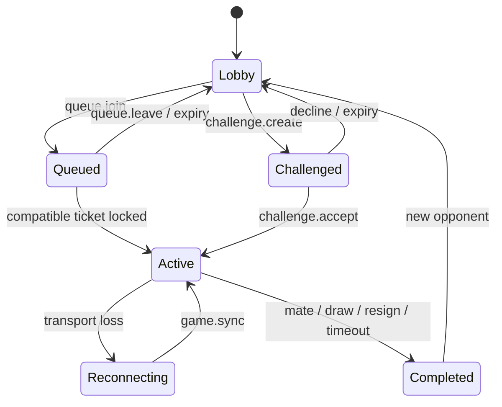

# Protocol and state model

Protocol version: `1.0.0`.

Every client command contains `protocolVersion`, `eventType`, a 12–120 character `eventId`, `clientSentAt`, optional `gameId`, and an object payload. The authenticated Clerk subject is the actor; identity in the body is never authoritative.

## Core events

| Direction | Events |
|---|---|
| Client | `presence.join`, `queue.join`, `queue.leave`, `challenge.create`, `challenge.accept`, `challenge.decline`, `game.move`, `game.resign`, `game.drawOffer`, `game.drawAccept`, `game.drawDecline`, `game.sync` |
| Server | `presence.snapshot`, `queue.status`, `match.found`, `game.snapshot`, `game.moveAccepted`, `game.moveRejected`, `game.result`, `challenge.updated`, `error` |

A move payload contains only `from`, `to`, optional `promotion`, and `expectedVersion`. The server loads the canonical game, confirms participation and turn, projects the authoritative clock, validates the move, derives SAN/FEN/result/PGN, and commits all values in one version-checked transaction.

## State machine

## Idempotency and ordering

- `eventId` is unique per game and duplicate commands return current state.
- `expectedVersion` prevents stale move commits.
- The game row is locked during every authoritative transition.
- Realtime messages carry no authority. Clients refetch and compare `version`.
- Event audit entries may share a chess ply (for example draw offers); `(game_id, event_id)` is the primary key.

## Clocks

The database stores remaining milliseconds for both colors and a server `clock_started_at` anchor. The browser interpolates for display. A move transaction recomputes elapsed time while holding the game lock. State reads also adjudicate an expired active clock, so a player cannot avoid a timeout merely by disconnecting.

## Rating

`caissa-elo-v1` starts at 1500, uses K=40 for the first 20 games and K=24 thereafter, and clamps ratings to 100–4000. It is a CAISSA product rating, not a FIDE rating. Casual games create no rating change. The result transaction writes before/after/delta once using `rating_processed_at`.
