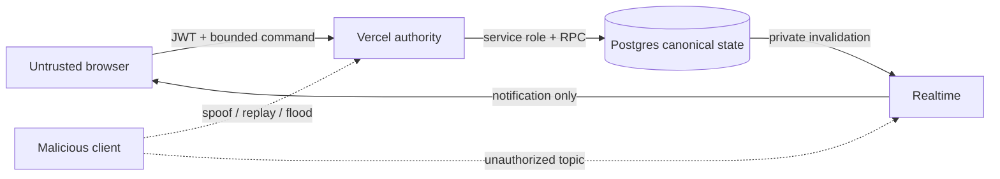

# CAISSA Online Native v1 threat model

## Scope and evidence

In scope: `/online`, `/api/online`, the online server/domain modules, `caissa_online_*` database objects, private Realtime Broadcast and browser recovery. Out of scope: retired `/play`, unrelated analysis/engine services, Clerk internals and Supabase platform internals.

Evidence reviewed includes the HTTP authority and authentication boundary, chess and clock projection, the service adapter, the complete migration and rollback, the private Realtime client, the page controller, and the online unit/browser tests.

An independent Codex Security scan was completed as scan `da2661dd-1584-4db1-9860-2b4ea17fe673`. It found eight issues in the pre-hardening snapshot: two high, four medium and two low. The implementation was subsequently hardened for all eight. The sealed report remains the historical evidence for that snapshot; it is not a post-fix verification or production sign-off.

## Assets and trust boundaries

High-value assets are game and clock integrity, rating integrity, account identity, private active-game state, durable PGN/history, service-role credentials and availability. Trust boundaries are browser to Vercel (untrusted JSON plus Clerk JWT), Vercel to Supabase (privileged service credential), Postgres to Realtime (server notification) and Realtime to browser (untrusted notification followed by authoritative refetch).

## Threat register

| ID | Threat / attack path | Impact | Control | Residual risk / action |
|---|---|---|---|---|
| T1 | Illegal, out-of-turn or fabricated-result move | Game/rating corruption | Verified Clerk subject; participant/turn/version/clock checks; chess.js legality; service-only commit RPC | Low. Pin and regression-test chess.js upgrades. |
| T2 | Replay or concurrent game creation/move | Duplicate games, moves or rating | Participant advisory locks, locked tickets/game rows, active-game recheck, durable event ID, expected version and exactly-once rating marker | Low. Stress-test simultaneous queue, challenge and move requests on a Supabase branch. |
| T3 | Client falsifies or pauses its clock | Time advantage | Browser clock is display-only; database recomputes elapsed time and adjudicates expired clocks before draw/resign | Low. Monitor regional time and commit latency. |
| T4 | Timeout awarded when the opponent cannot possibly mate | Incorrect result/rating | Server projects per-side mating potential after every move; database timeout helper converts such expiration to a draw | Low. Retain edge-case corpus for material-policy changes. |
| T5 | User reads another private game/topic | Privacy loss | Participant RLS uses Clerk `sub`; private topic policy resolves game ID; browser mutations and RPC execution are revoked | Medium until exercised with real Clerk JWTs against a Supabase branch. |
| T6 | Service-role key reaches browser/log | Database compromise | Public config exposes only publishable key; shared server client owns service credential; structured logs omit secrets/bodies | High impact, low likelihood. Add repository/deployment secret scanning and rotate on suspicion. |
| T7 | Forged Realtime payload changes client state | Board desync | Broadcast is invalidation only; client refetches authenticated canonical state and reconciles version | Low. Do not consume Broadcast row data as authority. |
| T8 | Matchmaking/challenge/API flood | Availability/harassment | Instance-local first layer plus locked, shared Postgres user/bucket limiter; separate challenge bucket; TTLs and payload bounds; production fails closed without shared limiting | Medium. A database-backed limiter adds write load; observe and migrate to a dedicated distributed limiter if scale warrants. |
| T9 | IDOR in challenge/draw/result action | Forced transition | Transaction locks the record and validates participant/challenged role; unmapped identity is rejected null-safely; draw acceptance requires opposing offer | Low. Add live RLS/RPC integration tests. |
| T10 | Stored display-name injection | XSS | Server character allowlist/length bound; rendered dynamic values are escaped | Low. Prefer `textContent` in future UI additions. |
| T11 | Oversized body or unbounded game history | Cost/availability | Both header and actual parsed-body 32 KiB checks; bounded fields; 6,000-ply and 512 KiB PGN database constraints; bounded server replay | Low/medium. Platform body parsing happens before the function; configure an upstream limit if the provider supports one. |
| T12 | Forged Clerk token from an unexpected web origin | Account action abuse | Clerk verification receives an explicit authorized-parties allowlist: canonical origin plus configured preview origins | Low if preview origins are kept exact. |
| T13 | Database function search-path hijack | Privilege escalation | Functions use empty `search_path`, qualify objects, and restrict private schema/function execution | Low. Database lint and real migration apply remain mandatory. |
| T14 | Tournament/spectator path leaks data | Privacy/abuse | Capabilities default off; no public organizer/write API; game read remains participant-only | Low today; repeat threat modeling before enabling. |

## Release security gates

Block production if any of these fail:

- Migration applies and lints cleanly on an isolated Supabase branch.
- Direct browser roles cannot execute mutation RPCs or write online tables.
- A non-participant cannot select a game or subscribe to its topic.
- Concurrent pairing/challenge acceptance cannot create two active games for one player.
- A duplicate move does not change version or rating twice.
- Disconnected timeout finalizes once and observes mating-potential draw rules.
- Service credentials do not appear in page config, bundles or logs.
- Shared limiting remains active under multiple function instances.
- Clerk authorized parties and CSP contain only intended production/preview origins.

## Residual conclusion

The discovered code-level issues are addressed and covered by static/unit contracts. Production remains **NO-GO** until the migration and authorization model are validated on a non-production Supabase project with two real Clerk accounts, concurrency probes, private-topic denial, and an explicit human release approval.
